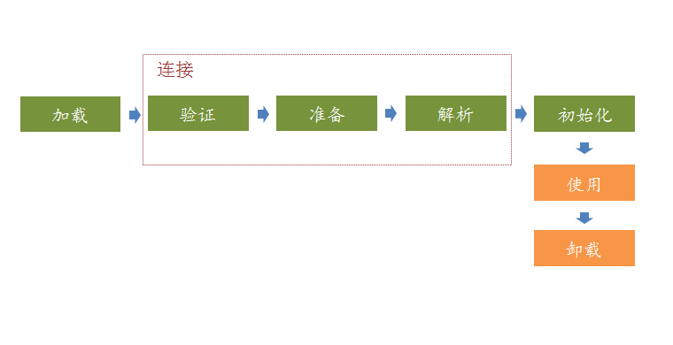

### 类加载过程
类的生命周期：

装载--->  连接（验证，准备，解析） -----> 初始化---->(对象的生命周期(对象实例化，使用，垃圾回收，对象终结)) -----> 卸载

**预处理**：
   1. 通过(前端编译器)编译器，将源代码编译成机器识别的字节码(.class)
   2. 通过类加载器，将字节流加载到内存中，供程序使用     

**类加载的过程**
 1. 加载：虚拟机完成三件事
    1. 通过类名获取类的二进制字节流，将字节流的内容转存到方法区
    2. 转化为特定的数据结构，初步校验常量池，cafababy文件长度
    3. 在内存中生成一个Class对象作为该方法区数据的访问入口(创建对应类的java.Class实例)
 2. 验证：
    验证加载的这个类是否合法（final是否合规，类型是否准确，静态变量是否合理等）
 3. 准备：
    为静态变量在方法区分配内存，并设置零值
 4. 解析：把常量池中的符号引用解析为直接引用。根据符号引用所作的描述，在内存中找到符合描述的目标并把目标指针返回，完成内存布局(**连接阶段的各项详细操作就看书吧，这里只是做一个总结**)
 5. 初始化：
    执行`<clinit>()`方法，之前静态变量设置的零值初始化为程序员设定的值。  
    注意： 
      - 并不是所有的类都有`<clinit>()`方法。类`<clinit>()`方法是由类变量的赋值动作，和静态语句块(static和static{})中的的代码合并的。
      - 虚拟机会保证子类的`<clinit>()`执行之前，一定会执行父类的`<clinit>()`
      - 虚拟机会保证一个类的`<clinit>()`在多线程环境中被正确的加锁、同步。          

   >记住我们这里谈到的都是类的初始化方法，这个和`<init>()`还是有区别的， `<init>()`方法是对象的初始化方法，一般是在对象创建的时候调用，包括new()关键字，调用Class或者java.lang.reflect.Constructor方法的或者当前对象的clone()方法的时候

 6. 使用
 7. 卸载    

**触发类加载的条件**  
1. 遇到new(使用new实例化对象)、getstatic(读取类的静态字段)、putstatic(设置类的静态字段)、invokestatic(调用类的静态方法)，这四条字节码指令时，如果类没有进行初始化，则需要触发其初始化（其它过程当然在类初始化之前）
2. 使用java.lang.reflect包的方法对类进行反射调用的时候，如果没有初始化，则会初始化
3. 如果初始化的过程发现其父类还没有初始化，
4. 虚拟机启动的时候首先初始化主类(包含main())
5. 使用动态语言(java.lang.invoke.MethodHandle)支持的时候,最后解析结果为REF_getStatic、REF_putStatic、REF_invokeStatic的时候，如果一个类还没有初始化的时候那么就会执行类的初始化
### 类加载器
#### 双亲委派模式
**类加载器**   

如上图，类加载器有这样几种 BootStrapClassLoader, ExtensionClassLoader,ApplicationClassLoader, 用户自定义ClassLoader。

java类加载器在加载类时，有如下这么几个过程
1. 先把这个请求委托给自己的父类加载继续执行，如果父类加载器还是在负责加载起，就继续向上委托，直到顶层的启动类加载器。
2. 如果父类加载器能够完成类的加载就成功返回，如果父类加载器无法完成加载，那么子加载器才会尝试自己去加载这个类

**好处**
1. 可以避免类的重复加载
2. 避免了Java的核心API被篡改

**什么情况下需要自定义类加载器呢**
1.  隔离加载类

    在某些框架内进行中间件与应用的模块隔离， 把类加载到不
    同的环境。比如， 阿里内某容器框架通过自定义类加载器确保应用中依赖的jar 包不
    会影响到中间件运行时使用的jar 包。
2. 修改类加载方式

    类的加载模型并非强制， 除Bootstrap 外， 其他的加载并
    非定要引入， 或者根据实际情况在某个时间点进行按需进行动态加载。
3. 拓展加载源

    比如从数据库、网络，甚至是电视机机顶盒进行加载。
4. 防止源码泄露

    Java 代码容易被编译和篡改，可以进行编译加密。那么类
    加载器也需要自定义，还原力口密的字节码。
#### 破坏双亲委派模式
**双亲委派模式三次被破坏：**
1. 向前兼容
2. 基础类调用用户代码
3. 类加载的动态性
举例tomcat类加载器是如何破坏双亲委派模式的

 
 