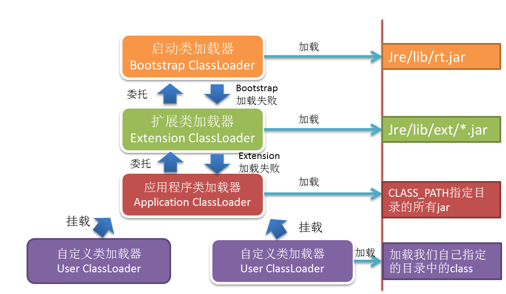
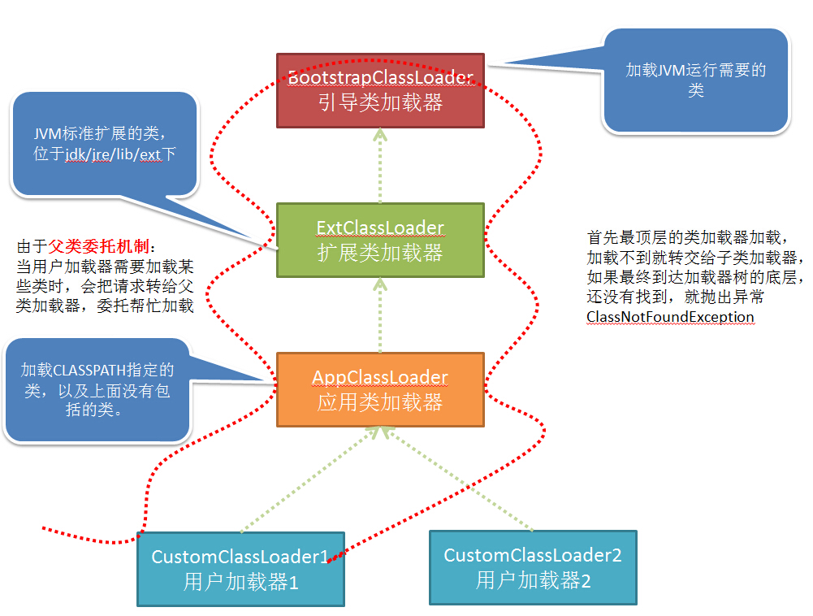

### 类加载过程
类的生命周期：


装载--->  连接（验证，准备，解析） -----> 初始化---->(对象的生命周期(对象实例化，使用，垃圾回收，对象终结)) -----> 卸载

**预处理**：
   1. 通过(前端编译器)编译器，将源代码编译成机器识别的字节码(.class)
   2. 通过类加载器，将字节流加载到内存中，供程序使用     

**类加载的过程**
 1. 加载：虚拟机完成三件事
    1. 通过类名获取类的二进制字节流，将字节流的内容转存到方法区
    2. 转化为特定的数据结构，初步校验常量池，cafebaby文件长度
    3. 在内存中生成一个Class对象作为该方法区数据的访问入口(创建对应类的java.Class实例)
 2. 验证：
    验证加载的这个类是否合法（final是否合规，类型是否准确，静态变量是否合理等）
 3. 准备：
    为静态变量在方法区分配内存，并设置零值
 4. 解析：把常量池中的符号引用解析为直接引用。根据符号引用所作的描述，在内存中找到符合描述的目标并把目标指针返回，完成内存布局(**连接阶段的各项详细操作就看书吧，这里只是做一个总结**)
 5. 初始化：
    执行`<clinit>()`方法，之前静态变量设置的零值初始化为程序员设定的值。  
    注意： 
      - 并不是所有的类都有`<clinit>()`方法。类`<clinit>()`方法是由类变量的赋值动作，和静态语句块(static和static{})中的的代码合并的。
      - 虚拟机会保证子类的`<clinit>()`执行之前，一定会执行父类的`<clinit>()`
      - 虚拟机会保证一个类的`<clinit>()`在多线程环境中被正确的加锁、同步。          

   >记住我们这里谈到的都是类的初始化方法，这个和`<init>()`还是有区别的， `<init>()`方法是对象的初始化方法，一般是在对象创建的时候调用，包括new()关键字，调用Class或者java.lang.reflect.Constructor方法的或者当前对象的clone()方法的时候

 6. 使用
 7. 卸载    

**触发类加载的条件**  
1. `遇到new(使用new实例化对象)`、`getstatic(读取类的静态字段)`、`putstatic(设置类的静态字段)`、`invokestatic(调用类的静态方法)`，这四条字节码指令时，如果类没有进行初始化，则需要触发其初始化（其它过程当然在类初始化之前）
2. 使用java.lang.reflect包的方法对类进行反射调用的时候，如果没有初始化，则会初始化
3. 如果初始化的过程发现其父类还没有初始化，
4. 虚拟机启动的时候首先初始化主类(包含main())
5. 使用动态语言(java.lang.invoke.MethodHandle)支持的时候,最后解析结果为`REF_getStatic`、`REF_putStatic`、`REF_invokeStatic`的时候，如果一个类还没有初始化的时候那么就会执行类的初始化

### 类加载器
#### 双亲委派模式
**类加载器**   

如上图，类加载器有这样几种 BootStrapClassLoader, ExtensionClassLoader,ApplicationClassLoader, 用户自定义ClassLoader。

`Bootstrap ClassLoader`： 引导类加载器，从%JAVA_RUNTIME_JRE%/lib目录加载，但并不是将该目录所有的类库都加载，它会加载一些符合文件名称的，例如：rt.jar,resources.jar等。在sun.misc.Launcher源码中也可以看得它的加载路径：

```java
private static String bootClassPath = System.getProperty("sun.boot.class.path");
```
或者配置-Xbootclasspath参数指定加载的路径，通过获取环境变量sun.boot.class.path看一下到底具体加载了那些类：

`Extension ClassLoader`：扩展类加载器，实现类为sun.misc.Launcher$ExtClassLoader，加载%JAVA_RUNTIME_JRE%/lib/ext/目录下的jar包，也可以在sun.misc.Launcher源码中也可以看得它的加载路径：
```java 
String s = System.getProperty("java.ext.dirs");
```
通过获取java.ext.dirs环境变量打印一下：
```
D:\Program Files\Java\jdk1.7.0_67\jre\lib\ext
```
`Appication ClassLoader`：应用程序类加载器，或者叫系统类加载器，实现类为sun.misc.Launcher$AppClassLoader。从sun.misc.Launcher的构造函数中可以看到，当AppClassLoader被初始化以后，它会被设置为当前线程的上下文类加载器以及保存到Launcher类的loader属性中，而通过ClassLoader.getSystemClassLoader()获取的也正是该类加载器(Launcher.loader)。应用类加载器从用户类路径中加载类库，可以在源码中看到：
```java
final String s = System.getProperty("java.class.path");
```
java类加载器在加载类时，有如下这么几个过程



1. 先把这个请求委托给自己的父类加载继续执行，如果父类加载器还是在负责加载起，就继续向上委托，直到顶层的启动类加载器。

2. 如果父类加载器能够完成类的加载就成功返回，如果父类加载器无法完成加载，那么子加载器才会尝试自己去加载这个类

3. 如果一直到底层的类加载都没有加载到，那么就会抛出异常ClassNotFoundException。

我们可以看看类加载器中`ClassLoader.loadClass()`的加载代码的加载过程：

```java
 protected Class<?> loadClass(String name, boolean resolve)
        throws ClassNotFoundException
    {
        synchronized (getClassLoadingLock(name)) {
            // 首先，查找该类是否已经被加载过了
            Class c = findLoadedClass(name);
            if (c == null) {  //未被加载过
                long t0 = System.nanoTime();
                try {
                    if (parent != null) {  // 父类加载器不为null，则调用父类加载器尝试加载
                        c = parent.loadClass(name, false);
                    } else {   // 父类加载器为null，则调用本地方法，交由启动类加载器加载，所以说ExtClassLoader的父类加载器为Bootstrap ClassLoader
                        c = findBootstrapClassOrNull(name);
                    }
                } catch (ClassNotFoundException e) {
                }
                if (c == null) { //仍然加载不到，只能由本加载器通过findClass去加载
                    long t1 = System.nanoTime();
                    c = findClass(name);
                    // this is the defining class loader; record the stats
                    sun.misc.PerfCounter.getParentDelegationTime().addTime(t1 - t0);
                    sun.misc.PerfCounter.getFindClassTime().addElapsedTimeFrom(t1);
                    sun.misc.PerfCounter.getFindClasses().increment();
                }
            }
            if (resolve) {
                resolveClass(c);
            }
            return c;
        }
    }
```
从代码中看到，如果parent==null，将会由启动类加载器尝试加载，所以扩展类加载器的父类加载器是启动类加载器。

那么JVM为什么需要双亲微拍模式呢？
**好处**
1. 可以避免类的重复加载
2. 避免了Java的核心API被篡改

**什么情况下需要自定义类加载器呢**
1.  隔离加载类

    在某些框架内进行中间件与应用的模块隔离， 把类加载到不
    同的环境。比如， 阿里内某容器框架通过自定义类加载器确保应用中依赖的jar 包不
    会影响到中间件运行时使用的jar 包。
2. 修改类加载方式

    类的加载模型并非强制， 除Bootstrap 外， 其他的加载并
    非定要引入， 或者根据实际情况在某个时间点进行按需进行动态加载。
3. 拓展加载源

    比如从数据库、网络，甚至是电视机机顶盒进行加载。
4. 防止源码泄露

    Java 代码容易被编译和篡改，可以进行编译加密。那么类
    加载器也需要自定义，还原力口密的字节码。
#### 破坏双亲委派模式
**双亲委派模式三次被破坏：**
1. 向前兼容
2. 基础类调用用户代码: 比如tomcat的设计，JNDI类加载过程，JDBC类加载过程等
3. 类加载的动态性


#### tomcat类加载器

**1、 既然 Tomcat 不遵循双亲委派机制，那么如果我自己定义一个恶意的HashMap，会不会有风险呢？(阿里的面试官问)?**

答： 显然不会有风险，如果有，Tomcat都运行这么多年了，那群Tomcat大神能不改进吗？ tomcat不遵循双亲委派机制，只是自定义的classLoader顺序不同，但顶层还是相同的，还是要去顶层请求classloader.

**2、我们思考一下：Tomcat是个web容器， 那么它要解决什么问题?**

1. 一个web容器可能需要部署两个应用程序，不同的应用程序可能会依赖`同一个第三方类库的不同版本`，不能要求同一个类库在同一个服务器只有一份，因此要保证每个应用程序的类库都是独立的，`保证相互隔离`。 
2. 部署在同一个web容器中相同的类库相同的版本可以共享。否则，如果服务器有10个应用程序，那么要有10份相同的类库加载进虚拟机，这是扯淡的。 
3. web容器也有自己依赖的类库，不能于应用程序的类库混淆。基于安全考虑，应该让容器的类库和程序的类库隔离开来。  
4. web容器要支持jsp的修改，我们知道，`jsp`文件最终也是要编译成class文件才能在虚拟机中运行，但程序运行后修改jsp(热更新)已经是司空见惯的事情，否则要你何用？ 所以，web容器需要支持jsp`热更新`。

**再看看我们的问题：**

3、**Tomcat 如果使用默认的类加载机制行不行？**

答案是不行的。为什么？我们看，
1. 上面第一个问题如果使用默认的类加载器机制，那么是无法加载两个相同类库的不同版本的，默认的累加器是不管你是什么  版本的，只在乎你的全限定类名，并且只有一份。
2. 第二个问题，默认的类加载器是能够实现的，因为他的职责就是保证唯一性。
3. 第三个问题和第一个问题一样。
4. 我们再看第四个问题，我们想我们要怎么实现jsp文件的热修改，jsp文件其实也就是class文件，那么如果修改了，但类名还是一样，类加载器会直接取方法区中已经存在的，修改后的jsp是不会重新加载的。那么怎么办呢？我们可以直接卸载掉这jsp文件的类加载器，所以你应该想到了，每个jsp文件对应一个唯 一的类加载器，当一个jsp文件修改了，就直接卸载这个jsp类加载器。重新创建类加载器，重新加载jsp文件。

4、 Tomcat 如何实现自己独特的类加载机制？

    Tomcat 是怎么实现的呢？牛逼的Tomcat团队已经设计好了。我们看看他们的设计图：


我们看到，前面3个类加载和默认的一致，`CommonClassLoader`、`CatalinaClassLoader`、`SharedClassLoader`和`WebappClassLoader`则是Tomcat自己定义的类加载器，它们分别加载`/common/*`、`/server/*`、`/shared/*`（在tomcat 6之后已经合并到根目录下的lib目录下）和/WebApp/WEB-INF/*中的Java类库。其中WebApp类加载器和Jsp类加载器通常会存在多个实例，每一个Web应用程序对应一个WebApp类加载器，每一个JSP文件对应一个Jsp类加载器。

1. CommonClassLoader

    Tomcat最基本的类加载器，加载路径中的class可以被Tomcat容器本身以及各个Webapp访问；
2. CatalinaClassLoader
   
    Tomcat容器私有的类加载器，加载路径中的class对于Webapp不可见；
3. SharedClassLoader
   
    各个Webapp共享的类加载器，加载路径中的class对于所有Webapp可见，但是对于Tomcat容器不可见；

4. WebappClassLoader：
    各个Webapp私有的类加载器，加载路径中的class只对当前Webapp可见；

从图中的委派关系中可以看出：
1. CommonClassLoader能加载的类都可以被Catalina ClassLoader和SharedClassLoader使用，从而实现了公有类库的共用，而CatalinaClassLoader和Shared ClassLoader自己能加载的类则与对方相互隔离。

2. WebAppClassLoader可以使用SharedClassLoader加载到的类，但各个WebAppClassLoader实例之间相互隔离。而JasperLoader的加载范围仅仅是这个JSP文件所编译出来的那一个.Class文件，它出现的目的就是为了被丢弃：当Web容器检测到JSP文件被修改时，会替换掉目前的JasperLoader的实例，并通过再建立一个新的Jsp类加载器来实现JSP文件的HotSwap功能。

好了，至此，我们已经知道了tomcat为什么要这么设计，以及是如何设计的，那么，tomcat 违背了java 推荐的双亲委派模型了吗？答案是：违背了。 我们前面说过：

双亲委派模型要求除了顶层的启动类加载器之外，其余的类加载器都应当由自己的父类加载器加载。

很显然，tomcat 不是这样实现，tomcat 为了实现隔离性，没有遵守这个约定，每个webappClassLoader加载自己的目录下的class文件，不会传递给父类加载器。

#### tomcat类加载器加载流程

1. 先从缓存中加载；
2. 如果没有，则从JVM的Bootstrap类加载器加载；
3. 如果没有，则从当前类加载器加载（按照WEB-INF/classes、WEB-INF/lib的顺序）；
4. 如果没有，则从父类加载器加载，由于父类加载器采用默认的委派模式，所以加载顺序是AppClassLoader、Common、Shared。

tomcat提供了delegate属性用于控制是否启用java委派模式，默认false（不启用），当设置为true时，tomcat将使用java的默认委派模式，这时加载顺序如下：

1. 先从缓存中加载；
2. 如果没有，则从JVM的Bootstrap类加载器加载；
3. 如果没有，则从父类加载器加载，加载顺序是AppClassLoader、Common、Shared。
4. 如果没有，则从当前类加载器加载（按照WEB-INF/classes、WEB-INF/lib的顺序）；


我们扩展出一个问题：
**如果tomcat 的 Common ClassLoader 想加载 WebApp ClassLoader 中的类，该怎么办？**

    看了前面的关于破坏双亲委派模型的内容，我们心里有数了，我们可以使用线程上下文类加载器实现，使用线程上下文加载器，可以让父类加载器请求子类加载器去完成类加载的动作。牛逼吧。


**问题扩展**

　　通过对上面tomcat类加载机制的理解，就不难明白 为什么java文件放在Eclipse中的src文件夹下会优先jar包中的class?

　　这是因为Eclipse中的src文件夹中的文件java以及webContent中的JSP都会在tomcat启动时，被编译成class文件放在 WEB-INF/class 中。

　　而Eclipse外部引用的jar包，则相当于放在 WEB-INF/lib 中。

　　因此肯定是 java文件或者JSP文件编译出的class优先加载。

　　通过这样，我们就可以简单的把java文件放置在src文件夹中，通过对该java文件的修改以及调试，便于学习拥有源码java文件、却没有打包成xxx-source的jar包。


　　另外呢，开发者也会因为粗心而犯下面的错误。

　　在 CATALINA_HOME/lib 以及 WEB-INF/lib 中放置了 不同版本的jar包，此时就会导致某些情况下报加载不到类的错误。

　　还有如果多个应用使用同一jar包文件，当放置了多份，就可能导致 多个应用间 出现类加载不到的错误。


>先在本地缓存中查找是否已经加载过该类(对于一些已经加载了的类，会被缓存在resourceEntries这个数据结构中)，如果已经加载即返回，否则 继续下一步。
让系统类加载器(AppClassLoader)尝试加载该类，主要是为了防止一些基础类会被web中的类覆盖，如果加载到即返回，返回继续。
前两步均没加载到目标类，那么web应用的类加载器将自行加载，如果加载到则返回，否则继续下一步。
最后还是加载不到的话，则委托父类加载器(Common ClassLoader)去加载。
第3第4两个步骤的顺序已经违反了双亲委托机制，除了tomcat之外，JDBC,JNDI,Thread.currentThread().setContextClassLoader();等很多地方都一样是违反了双亲委托。

tomcat部分来源于： https://www.cnblogs.com/aspirant/p/8991830.html


 