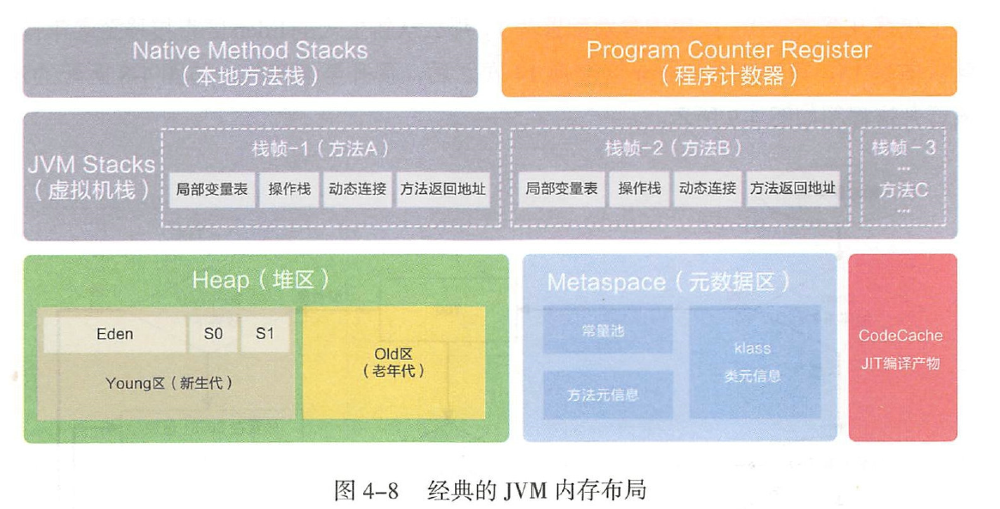
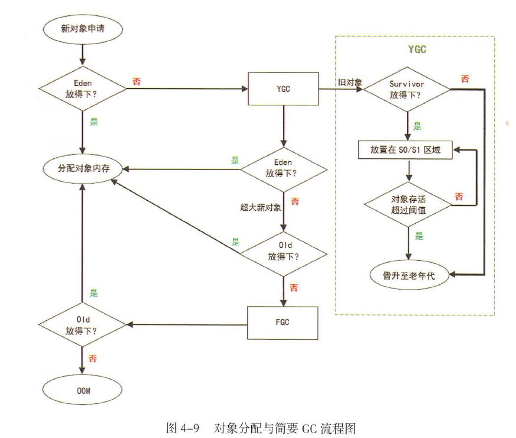
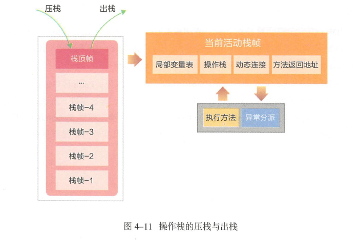

#### java内存布局

内存是非常重要的系统资源，是硬盘和CPU的中间仓库及桥梁，承载着操作系统和
应用程序的实时运行。JVM内存布局规定了Java在运行过程中内存中请、分配、管理的
策略，保证了JVM的高效稳定运行。不同的JVM对于内存的划分方式和管理机制存在
着部分差异。结合JVM虚拟机规范，来探讨一下经典的JVM内存布局

内存布局图如下


##### Heap（堆区）

Heap是OOM故障最主要的发源地，它存储着几乎所有的实例对象，堆由垃圾
收集器自动回收，堆区由各子线程共享使用。通常情况下，它占用的空间是所有内存
区域中最大的，但如果无节制地创建大量对象，也容易易消耗完所有的空间。堆的内存
空间既可以固定大小，也可以在运行时动态地调整，通过如下参数设定初始值和最大
值，比如`－Xms256M-Xmxl024M`，其中－X表示它是JVM运行参数，ms是memory
start的简称，mx是memorymax的简称，分别代表最小堆容量和最大堆容量。但是
在通常情况下，服务器在运行过程中，堆空间不断地扩容与回缩，势必形成不必要的
系统压力，所以在线上生产环境中，JVM的Xms和Xmx设置成样大小，避免在
GC后调整堆大小时带来的额外压力。

堆分成两大块新生代和老年代。对象产生之初在新生代，步入暮年时进入老年
代，但是老年代也接纳在新生代无法容纳的超大对象。新生代＝1个Eden区＋2个
Survivor区之和。绝大部分对象在Eden区生成，当Eden区装填满的时候，会触发Young
GarbageCollection，即YGC。垃圾回收的时候，在Eden区实现清除策略，没有被引
用的对象则直接回收。依然存活的对象会被移送到Survivor区，这个区真是名副其
实的存在。Survivor区分为so和Sl两块内存空间，送到哪块空间呢？每次YGC的
时候，它们将存活的对象复制到未使用的那块空间，然后将当前正在使用的空间完
全清除，交换两块空间的使用状态。如果YGC要移送的对象大于Survivor区容量的
上限，则直接移交给老年代。假如一些没有进取心的对象以为可以一直在新生代的
Survivor区交换来交换去，那就错了。每个对象都有一个计数器，每次YGC都会加
l。`－XX:MaxTenuringThreshold`参数能配置计数器的值到达某个阐值的时候，对象从
新生代晋升至老年代。如果该参数配置为I，那么从新生代的Eden区直接移至老年代。
默认值是15，可以在Survivor区交换14次之后，晋升至老年代。与图4-8匹配的对
象晋升流程图下图所示。



上图中，如果Survivor区无法放下，或者超大对象的闹值超过上限，则尝试
在老年代中进行分配；如果老年代也无法放下，则会触发FullGarbageCollection，即
FGC。如果依然无法放下，则抛出OOM。堆内存出现OOM的概率是所有内存耗尽
异常中最高的。出错时的堆内信息对解决问题非常有帮助，所以给JVM设置运行参
数`－XX:+HeapDumpOnOutOfMemoryError`，让JVM遇到OOM异常时能输出堆内信息，
特别是对相隔数月才出现的OOM异常尤为重要。
在不同的JVM实现及不同的回收机制中，堆内存的划分方式是不一样的。

##### Metaspace（元空间）
本书源码解析和示例代码基本采用JDKll版本，JVM则为Hotspot。早在JDK8
版本中，元空间的前身Perm区已经被淘汰。在JDK7及之前的版本中，只有Hotspot
才有Perm区，译为永久代，它在启动时固定大小，很难进行调优，并且FGC时会移
动类元信息。在某些场景下，如果动态加载类过多，容易产生Perm区的OOM。比
如某个实际Web工程中，因为功能点比较多，在运行过程中，要不断动态加载很多
的类，经常出现致命错误。

"Exceptioninthread'dubboclientx.xconnector'java.lang.OutOfMmoryError:PennGenspace"

为了解决该问题，需要设定运行参数`－XX:MaxPermSize=1280m`，如果部署到
新机器上，往往会因为NM参数没有修改导致故障再现。不熟悉此应用的人排查
问题时往往苦不堪言，除此之外，永久代在垃圾回收过程中还存在诸多问题。所
以，JDK8使用元空间替换永久代。在JDK8及以上版本中，设定MaxPermSize参
数，JVM在启动时并不会报锚，但是会提示：`JavaHotSpot64BitServerVMwarning:
ignoringoptionMaxPem1Size=2560m;supportwasremovedin8.0。`
区别于永久代，`元空间在本地内存中分配`。在JDK8里，Perm区中的所有内容
中字符串常量移至堆内存，其他内容包括类元信息、字段、静态属性、方法、常量等
都移动至元空间内，比如下图中的Object类元信息、静态属性System.out、整型
常量10000000等。下图中显示在常量池中的String，其实际对象是被保存在堆内
存中的。


##### JVMStack(虚拟机栈）
栈（Stack）是－个先进后出的数据结构，就像子弹的弹夹，最后压入的子弹先发射，
压在底部的子弹最后发射，撞针只能访问位于顶部的那一颗子弹。
相对于基于寄存器的运行环境来说，JVM是基于栈结构的运行环境。栈结构移
植性更好，可控性更强。JVM中的虚拟机栈是描述Java方法执行的内存区域，它是
`线程私有`的。栈中的元素用于支持虚拟机进行方法调用，每个方法从开始调用到执行
完成的过程，就是栈帧从入栈到出栈的过程。在活动线程中，只有位于栈顶的帧才是
有效的，称为当前栈帧。正在执行的方法称为当前方法，栈帧是方法运行的基本结构。
在执行引擎运行时，所有指令都只能针对当前栈帧进行操作。而`StackOverflowError`
表示请求的栈溢出，导致内存耗尽，通常出现在递归方法中。JVM能够横扫干军，
虚拟机栈就是它的心腹大将，当前方法的栈帧，都是正在战斗的战场，其中的操作栈
是参与战斗的士兵。操作栈的压栈与出栈下图。



虚拟机栈通过压栈和出栈的方式，对每个方法对应的活动栈帧进行运算处理，方
法正常执行结束，肯定会跳转到另一个栈帧上。在执行的过程中，如果出现异常，会
进行异常回溯，返回地址通过异常处理表确定。栈帧在整个JVM体系中的地位颇高，
包括`局部变量表`、`操作栈`、`动态连接`、`方法返回地址`等。

1. 局部变量表   
局部变量表是存放方法参数和局部变量的区域。相对于类属性变量的准备阶段和
初始化阶段来说，局部变量没有准备阶段，必须显式初始化。如果是非静态方法，则
在index[O］位置上存储的是方法所属对象的实例引用，随后存储的是参数和局部变量。
字节码指令中的`STORE`指令就是将操作栈中计算完成的局部变量写回局部变量表的
`存储空间`内。

2. 操作栈   
操作栈是一个初始状态为空的`桶式结构栈`。在方法执行过程中，会有各种指令往
栈中写人和提取信息。JVM的执行引擎是基于栈的执行引擎，其中的栈指的就是操
作栈。字节码指令集的定义都是基于栈类型的，`栈的深度在方法元信息的stack属性`中，
下面用一段简单的代码说明操作栈与局部变量表的交互：

```
publicintsimpleMethod(){
intx=13;
inty=14;
intz=x+y;
returnz;

}

```
详细的字节码操作顺序如下:
```c++
publicsimpleMethod();
descriptor:()
flags:ACCPUBLIC
Code:
stack＝2，locals=4,args_Size=1//最大栈深度为2，局部变量个数为4
BIPUSH13//常量13压入栈顶
ISTORE1//并保存到局部变量slot_1中（第一处）
BIPUSH14//常量14压入操作栈，注意是BIPUSH
ISTORE2//并保存到局部变量表的slot_2中
ILOAD1//把局部变量表的slot_1元素（intx）压入操作栈
ILOAD2//把局部变量表的slot_2元素（inty）压入操作栈
工ADD//把上方的两个数都取出来，在CPU里面加一下，并压回操作栈顶
ISTORE3//把栈顶的结果存储到局部变量的slot_3
ILOAD3
IRETURN//返回栈顶元素值
```

第l处说明局部变量表就像－个中药柜，里面有很多抽屉，依次编号为0,1,2,
3,... ,n，字节码指令`ISTORE_l`就是打开1号抽屉，把栈顶中的数13存进去。栈
是一个很深的竖桶，任何时候只能对桶口元素进行操作，所以数据只能在栈顶进行存
取。某些指令可以直接在抽屉里进行，比如`iinc`指令，直接对抽屉里的数值进行＋l
操作。程序员面试过程中，常见的i＋＋和＋＋i的区别，可以从字节码上对比出来，如
下图


上图中`iload_l`从局部变量表的第l号抽屉里取出一个数，压入栈1页，
下一步直接在抽屉里实现＋l的操作，而这个操作对栈顶元素的值没有影响。所以
`istore_2`只是把栈顶元素赋值给a，图右列，先在第l号；由屉里执行＋l操作，然
后通过`iload_l`把第1号抽屉里的数压人栈顶，所以`istore_2`存人的是＋1之后的值。
这里延伸一个信息，i＋＋并非原子操作。即使通过volatile关键字进行修饰，多
个线程同时写的话，也会产生数据互相覆盖的问题。

3. 动态连接

每个栈帧中包含一个在常量池中对当前方法的引用，目的是支持方法调用过程的
动态连接。
4）方法返回地址
方法执行时有两种退出情况第，正常退出，即正常执行到任何方法的返回字
节码指令，如RETURN、IRETURN、ARETURN等，第二，异常退出。无论何种退
出情况，都将返回至方法当前被调用的位置。方法退出的过程相当于弹出当前栈帧，
退出可能有三种方式:
    - 返回值压入上层调用栈帧。
    - 异常信息抛给能够处理的栈帧。
    - PC计数器指向方法调用后的下一条指令。

##### NativeMethodStacks（本地方法栈）
本地方法栈（NativeMethodStack）在JVM内存布局中，也是线程对象私有的，
但是虚拟机栈“主内”，而本地方法栈“主外”。这个“内外”是针对JVM来说的，
`本地方法栈为Native方法服务`。线程开始调用本地方法时，会进入一个不再受JVM
约束的世界。本地方法可以通过JNI(JavaNativeInterface）来访问虚拟机运行时的
数据区，甚至可以调用寄存器，具有和JVM相同的能力和权限。当大量本地方法出
现时，势必会削弱JVM对系统的控制力，因为它的出错信息都比较黑盒。对于内存
不足的情况，本地方法栈还是会抛出nativeHeapOutOfMemory。
重点说一下JNI类本地方法，最著名的本地方法应该是System.
currentTimeMillis(),JNI使Java深度使用操作系统的特性功能，复用非Java代码。
但是在项目过程中，如果大量使用其他语言来实现JNI，就会丧失跨平台特性，威胁
到程序运行的稳定性。假如需要与本地代码交互，就可以用中间标准框架进行解耦，
这样即使本地方法崩溃也不至于影响到JVM的稳定。当然，如果要求极高的执行效率、
偏底层的跨进程操作等，可以考虑设计为JNI调用方式。

##### ProgramCounterRegister（程序计数寄存器）
在程序计数寄存器（ProgramCounterRegister,PC）中，Register的命名源于
CPU的寄存器，CPU只有把数据装载到寄存器才能够运行。寄存器存储指令相关的
现场信息，由于CPU时间片轮限制，众多线程在并发执行过程中，任何一个确定的
时刻，一个处理器或者多核处理器中的一个内核，只会执行某个线程中的一条指令。
这样必然导致经常中断或恢复，如何保证分毫无差呢？每个线程在创建后，都会产生
自己的程序计数器和栈帧，程序计数器用来存放执行指令的偏移量和行号指示器等，
线程执行或恢复都要依赖程序计数器。程序计数器在各个线程之间互不影响，此区域
也不会发生内存溢出异常。
最后，从线程共享的角度来看，堆和元空间是所有线程共享的，而虚拟机栈、本
地方法栈、程序计数器是线程内部私有的，从这个角度看下Java内存结构，如图4-12
所示。


####jvm中常使用的参数

几个示例jvm调优参数见[jvm_调优参数.xlsx](../../../etc/jvm/jvm_调优参数.xlsx)


**来源**：
1. 码出高效:java开发手册
2. https://www.cnblogs.com/anyehome/p/9071619.html
3. https://www.ibm.com/developerworks/cn/java/j-lo-jvm-optimize-experience/index.html

