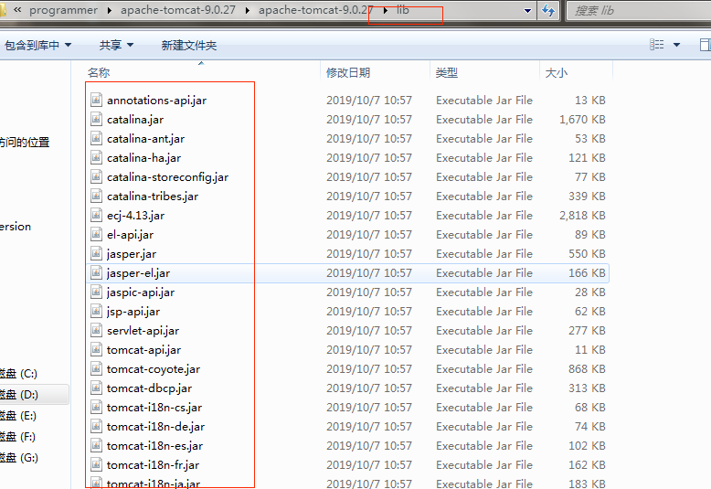

### 图解Tomcat类加载机制

**1、 既然 Tomcat 不遵循双亲委派机制，那么如果我自己定义一个恶意的HashMap，会不会有风险呢？(阿里的面试官问)?**

答： 显然不会有风险，如果有，Tomcat都运行这么多年了，那群Tomcat大神能不改进吗？ tomcat不遵循双亲委派机制，只是自定义的classLoader顺序不同，但顶层还是相同的，还是要去顶层请求classloader.

**2、我们思考一下：Tomcat是个web容器， 那么它要解决什么问题?**

1. 一个web容器可能需要部署两个应用程序，不同的应用程序可能会依赖`同一个第三方类库的不同版本`，不能要求同一个类库在同一个服务器只有一份，因此要保证每个应用程序的类库都是独立的，`保证相互隔离`。 
2. 部署在同一个web容器中相同的类库相同的版本可以共享。否则，如果服务器有10个应用程序，那么要有10份相同的类库加载进虚拟机，这是扯淡的。 
3. web容器也有自己依赖的类库，不能于应用程序的类库混淆。基于安全考虑，应该让容器的类库和程序的类库隔离开来。  
4. web容器要支持jsp的修改，我们知道，`jsp`文件最终也是要编译成class文件才能在虚拟机中运行，但程序运行后修改jsp(热更新)已经是司空见惯的事情，否则要你何用？ 所以，web容器需要支持jsp`热更新`。

**再看看我们的问题：**

3、**Tomcat 如果使用默认的类加载机制行不行？**

答案是不行的。为什么？我们看，
1. 上面第一个问题如果使用默认的类加载器机制，那么是无法加载两个相同类库的不同版本的，默认的累加器是不管你是什么  版本的，只在乎你的全限定类名，并且只有一份。
2. 第二个问题，默认的类加载器是能够实现的，因为他的职责就是保证唯一性。
3. 第三个问题和第一个问题一样。
4. 我们再看第四个问题，我们想我们要怎么实现jsp文件的热修改，jsp文件其实也就是class文件，那么如果修改了，但类名还是一样，类加载器会直接取方法区中已经存在的，修改后的jsp是不会重新加载的。那么怎么办呢？我们可以直接卸载掉这jsp文件的类加载器，所以你应该想到了，每个jsp文件对应一个唯 一的类加载器，当一个jsp文件修改了，就直接卸载这个jsp类加载器。重新创建类加载器，重新加载jsp文件。

4、 Tomcat 如何实现自己独特的类加载机制？

    Tomcat 是怎么实现的呢？牛逼的Tomcat团队已经设计好了。我们看看他们的设计图：

我们看到，前面3个类加载和默认的一致，`CommonClassLoader`、`CatalinaClassLoader`、`SharedClassLoader`和`WebappClassLoader`则是Tomcat自己定义的类加载器，它们分别加载`/common/*`、`/server/*`、`/shared/*`（在tomcat 6之后已经合并到根目录下的lib目录下）和/WebApp/WEB-INF/*中的Java类库。其中WebApp类加载器和Jsp类加载器通常会存在多个实例，每一个Web应用程序对应一个WebApp类加载器，每一个JSP文件对应一个Jsp类加载器。

1. commonLoader：

    Tomcat最基本的类加载器，加载路径中的class可以被Tomcat容器本身以及各个Webapp访问；
2. catalinaLoader：
    
    Tomcat容器私有的类加载器，加载路径中的class对于Webapp不可见；
3. sharedLoader：
    
    各个Webapp共享的类加载器，加载路径中的class对于所有Webapp可见，但是对于Tomcat容器不可见；

4. WebappClassLoader：
    各个Webapp私有的类加载器，加载路径中的class只对当前Webapp可见；

从图中的委派关系中可以看出：
1. CommonClassLoader能加载的类都可以被Catalina ClassLoader和SharedClassLoader使用，从而实现了公有类库的共用，而CatalinaClassLoader和Shared ClassLoader自己能加载的类则与对方相互隔离。

2. WebAppClassLoader可以使用SharedClassLoader加载到的类，但各个WebAppClassLoader实例之间相互隔离。而JasperLoader的加载范围仅仅是这个JSP文件所编译出来的那一个.Class文件，它出现的目的就是为了被丢弃：当Web容器检测到JSP文件被修改时，会替换掉目前的JasperLoader的实例，并通过再建立一个新的Jsp类加载器来实现JSP文件的HotSwap功能。

好了，至此，我们已经知道了tomcat为什么要这么设计，以及是如何设计的，那么，tomcat 违背了java 推荐的双亲委派模型了吗？答案是：违背了。 我们前面说过：

双亲委派模型要求除了顶层的启动类加载器之外，其余的类加载器都应当由自己的父类加载器加载。

很显然，tomcat 不是这样实现，tomcat 为了实现隔离性，没有遵守这个约定，每个webappClassLoader加载自己的目录下的class文件，不会传递给父类加载器。

我们扩展出一个问题：
**如果tomcat 的 Common ClassLoader 想加载 WebApp ClassLoader 中的类，该怎么办？**

    看了前面的关于破坏双亲委派模型的内容，我们心里有数了，我们可以使用线程上下文类加载器实现，使用线程上下文加载器，可以让父类加载器请求子类加载器去完成类加载的动作。牛逼吧。

Tomcat类加载

　　在tomcat中类的加载稍有不同，如下图：

当tomcat启动时，会创建几种类加载器：

1. Bootstrap 引导类加载器 
    
    加载JVM启动所需的类，以及标准扩展类（位于jre/lib/ext下）

2. System 系统类加载器 

　　加载tomcat启动的类，比如bootstrap.jar，通常在catalina.bat或者catalina.sh中指定。位于CATALINA_HOME/bin下。

3. Common 通用类加载器 

　　加载tomcat使用以及应用通用的一些类，位于CATALINA_HOME/lib下，比如servlet-api.jar

4. webapp 应用类加载器

　　每个应用在部署后，都会创建一个唯一的类加载器。该类加载器会加载位于 WEB-INF/lib下的jar文件中的class 和 WEB-INF/classes下的class文件。

 
##### 当应用需要到某个类时，则会按照下面的顺序进行类加载：

1. 使用bootstrap引导类加载器加载

2. 使用system系统类加载器加载

3. 使用应用类加载器在WEB-INF/classes中加载

4. 使用应用类加载器在WEB-INF/lib中加载

5. 使用common类加载器在CATALINA_HOME/lib中加载

 

**问题扩展**

　　通过对上面tomcat类加载机制的理解，就不难明白 为什么java文件放在Eclipse中的src文件夹下会优先jar包中的class?

　　这是因为Eclipse中的src文件夹中的文件java以及webContent中的JSP都会在tomcat启动时，被编译成class文件放在 WEB-INF/class 中。

　　而Eclipse外部引用的jar包，则相当于放在 WEB-INF/lib 中。

　　因此肯定是 java文件或者JSP文件编译出的class优先加载。

　　通过这样，我们就可以简单的把java文件放置在src文件夹中，通过对该java文件的修改以及调试，便于学习拥有源码java文件、却没有打包成xxx-source的jar包。

　　另外呢，开发者也会因为粗心而犯下面的错误。

　　在 CATALINA_HOME/lib 以及 WEB-INF/lib 中放置了 不同版本的jar包，此时就会导致某些情况下报加载不到类的错误。

　　还有如果多个应用使用同一jar包文件，当放置了多份，就可能导致 多个应用间 出现类加载不到的错误。

 
>先在本地缓存中查找是否已经加载过该类(对于一些已经加载了的类，会被缓存在resourceEntries这个数据结构中)，如果已经加载即返回，否则 继续下一步。
让系统类加载器(AppClassLoader)尝试加载该类，主要是为了防止一些基础类会被web中的类覆盖，如果加载到即返回，返回继续。
前两步均没加载到目标类，那么web应用的类加载器将自行加载，如果加载到则返回，否则继续下一步。
最后还是加载不到的话，则委托父类加载器(Common ClassLoader)去加载。
第3第4两个步骤的顺序已经违反了双亲委托机制，除了tomcat之外，JDBC,JNDI,Thread.currentThread().setContextClassLoader();等很多地方都一样是违反了双亲委托。

来源： https://www.cnblogs.com/aspirant/p/8991830.html