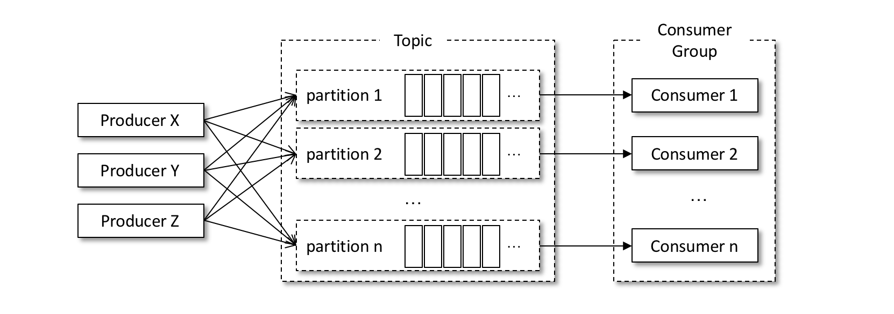

#### 有哪些情形会造成重复消费？

1. Rebalance
    一个consumer正在消费一个分区的一条消息，还没有消费完，发生了rebalance(加入了一个consumer)，从而导致这条消息没有消费成功，rebalance后，另一个consumer又把这条消息消费一遍。
2. 消费者端手动提交
    如果先消费消息，再更新offset位置，导致消息重复消费。
3. 消费者端自动提交
    设置offset为自动提交，关闭kafka时，如果在close之前，调用 consumer.unsubscribe() 则有可能部分offset没提交，下次重启会重复消费。
4. 生产者端
    生产者因为业务问题导致的宕机，在重启之后可能数据会重发

#### 那些情景下会造成消息漏消费？

1. 自动提交
    设置offset为自动定时提交，当offset被自动定时提交时，数据还在内存中未处理，此时刚好把线程kill掉，那么offset已经提交，但是数据未处理，导致这部分内存中的数据丢失。
2. 生产者发送消息
    发送消息设置的是fire-and-forget（发后即忘），它只管往 Kafka 中发送消息而并不关心消息是否正确到达。不过在某些时候（比如发生不可重试异常时）会造成消息的丢失。这种发送方式的性能最高，可靠性也最差。
3. 消费者端
    先提交位移，但是消息还没消费完就宕机了，造成了消息没有被消费。自动位移提交同理
4. acks没有设置为all
    如果在broker还没把消息同步到其他broker的时候宕机了，那么消息将会丢失

#### KafkaConsumer是非线程安全的，那么怎么样实现多线程消费？

线程封闭，即为每个线程实例化一个 KafkaConsumer 对象



一个线程对应一个 KafkaConsumer 实例，我们可以称之为消费线程。一个消费线程可以消费一个或多个分区中的消息，所有的消费线程都隶属于同一个消费组。

1. 消费者程序使用单或多线程获取消息，同时创建多个消费线程执行消息处理逻辑。
    获取消息的线程可以是一个，也可以是多个，每个线程维护专属的 KafkaConsumer 实例，处理消息则交由特定的线程池来做，从而实现消息获取与消息处理的真正解耦。具体架构如下图所示：	


两个方案对比：


#### 简述消费者与消费组之间的关系

1. Consumer Group 下可以有一个或多个 Consumer 实例。这里的实例可以是一个单独的进程，也可以是同一进程下的线程。在实际场景中，使用进程更为常见一些。
2. Group ID 是一个字符串，在一个 Kafka 集群中，它标识唯一的一个 Consumer Group。
3. Consumer Group 下所有实例订阅的主题的单个分区，只能分配给组内的某个 Consumer 实例消费。这个分区当然也可以被其他的 Group 消费。

#### 当你使用kafka-topics.sh创建（删除）了一个topic之后，Kafka背后会执行什么逻辑？

在执行完脚本之后，Kafka 会在 log.dir 或 log.dirs 参数所配置的目录下创建相应的主题分区，默认情况下这个目录为/tmp/kafka-logs/。

在 ZooKeeper 的/brokers/topics/目录下创建一个同名的实节点，该节点中记录了该主题的分区副本分配方案。示例如下：

```
Copy[zk: localhost:2181/kafka(CONNECTED) 2] get /brokers/topics/topic-create
{"version":1,"partitions":{"2":[1,2],"1":[0,1],"3":[2,1],"0":[2,0]}}
```

#### topic的分区数可不可以增加？如果可以怎么增加？如果不可以，那又是为什么？

可以增加，使用 kafka-topics 脚本，结合 --alter 参数来增加某个主题的分区数，命令如下：

```
Copybin/kafka-topics.sh --bootstrap-server broker_host:port --alter --topic <topic_name> --partitions <新分区数>
```

当分区数增加时，就会触发订阅该主题的所有 Group 开启 Rebalance。
 首先，Rebalance 过程对 Consumer Group 消费过程有极大的影响。在 Rebalance 过程中，所有 Consumer 实例都会停止消费，等待 Rebalance 完成。这是 Rebalance 为人诟病的一个方面。
 其次，目前 Rebalance 的设计是所有 Consumer 实例共同参与，全部重新分配所有分区。其实更高效的做法是尽量减少分配方案的变动。
 最后，Rebalance 实在是太慢了。

#### topic的分区数可不可以减少？如果可以怎么减少？如果不可以，那又是为什么？

不支持，因为删除的分区中的消息不好处理。如果直接存储到现有分区的尾部，消息的时间戳就不会递增，如此对于 Spark、Flink  这类需要消息时间戳（事件时间）的组件将会受到影响；如果分散插入现有的分区，那么在消息量很大的时候，内部的数据复制会占用很大的资源，而且在复制期间，此主题的可用性又如何得到保障？与此同时，顺序性问题、事务性问题，以及分区和副本的状态机切换问题都是不得不面对的。

#### 创建topic时如何选择合适的分区数？

在 Kafka 中，性能与分区数有着必然的关系，在设定分区数时一般也需要考虑性能的因素。对不同的硬件而言，其对应的性能也会不太一样。
 可以使用Kafka 本身提供的用于生产者性能测试的 kafka-producer- perf-test.sh 和用于消费者性能测试的 kafka-consumer-perf-test.sh来进行测试。
 增加合适的分区数可以在一定程度上提升整体吞吐量，但超过对应的阈值之后吞吐量不升反降。如果应用对吞吐量有一定程度上的要求，则建议在投入生产环境之前对同款硬件资源做一个完备的吞吐量相关的测试，以找到合适的分区数阈值区间。
 分区数的多少还会影响系统的可用性。如果分区数非常多，如果集群中的某个 broker 节点宕机，那么就会有大量的分区需要同时进行 leader 角色切换，这个切换的过程会耗费一笔可观的时间，并且在这个时间窗口内这些分区也会变得不可用。
 分区数越多也会让 Kafka 的正常启动和关闭的耗时变得越长，与此同时，主题的分区数越多不仅会增加日志清理的耗时，而且在被删除时也会耗费更多的时间。

#### Kafka目前有那些内部topic，它们都有什么特征？各自的作用又是什么？

`__consumer_offsets`：作用是保存 Kafka 消费者的位移信息
`__transaction_state`：用来存储事务日志消息

#### 优先副本是什么？它有什么特殊的作用？

所谓的优先副本是指在AR集合列表中的第一个副本。
 理想情况下，优先副本就是该分区的leader 副本，所以也可以称之为 preferred leader。Kafka 要确保所有主题的优先副本在  Kafka 集群中均匀分布，这样就保证了所有分区的 leader 均衡分布。以此来促进集群的负载均衡，这一行为也可以称为“分区平衡”。