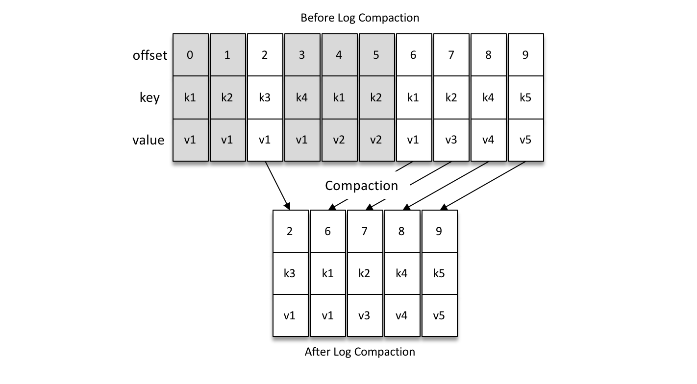
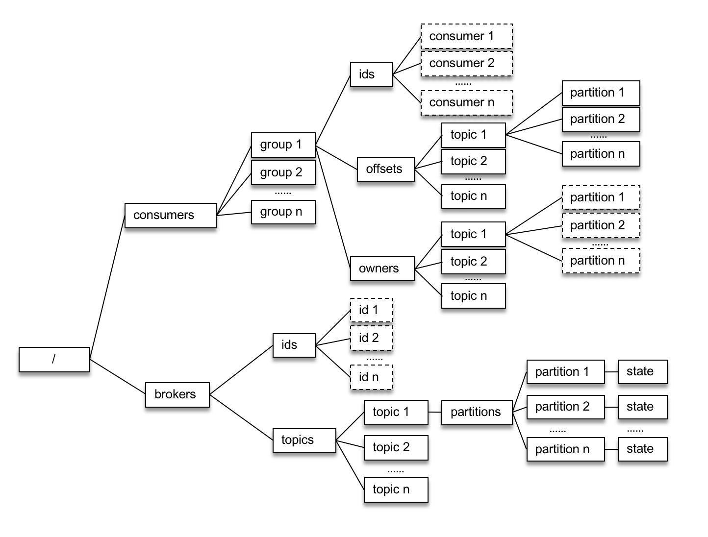

 [Kafka有哪几处地方有分区分配的概念？简述大致的过程及原理](#kafka有哪几处地方有分分配的概念简述大致的过程及原理)

 [简述Kafka的日志目录结构](#简述kafka的日志目录结构)

 [Kafka中有那些索引文件？](#kafka中有那些索引文件)

 [如果我指定了一个offset，Kafka怎么查找到对应的消息？](#如果我指定了一offsetkafka怎么查找到对应的消息)

 [如果我指定了一个timestamp，Kafka怎么查找到对应的消息？](#如果我指定了一timestampkafka怎么查找到对应的消息)

 [聊一聊你对Kafka的Log Retention的理解](#聊一聊你对kafka的log-retention的理解)

 [聊一聊你对Kafka的Log Compaction的理解](#聊一聊你对kafka的log-compaction的理解)

 [聊一聊你对Kafka底层存储的理解（页缓存、内核层、块层、设备层）](#聊一聊你对kafka层存储的理解页缓存内核层块层设备层)

 [零拷贝](#零拷贝)

 [聊一聊Kafka的延时操作的原理](#聊一聊kafka的延时操作的原理)

 [聊一聊Kafka控制器的作用](#聊一聊kafka控制器的作用)

 [Kafka的旧版Scala的消费者客户端的设计有什么缺陷？](#kafka的旧版scala的消费者客户端的设计有什么缺陷)

#### Kafka有哪几处地方有分区分配的概念？简述大致的过程及原理

1. 生产者的分区分配是指为每条消息指定其所要发往的分区。可以编写一个具体的类实现org.apache.kafka.clients.producer.Partitioner接口。
2. 消费者中的分区分配是指为消费者指定其可以消费消息的分区。Kafka 提供了消费者客户端参数 `partition.assignment.strategy` 来设置消费者与订阅主题之间的分区分配策略。
3. 分区副本的分配是指为集群制定创建主题时的分区副本分配方案，即在哪个 broker 中创建哪些分区的副本。kafka-topics.sh 脚本中提供了一个 `replica-assignment `参数来手动指定分区副本的分配方案。

#### 简述Kafka的日志目录结构

Kafka  中的消息是以主题为基本单位进行归类的，各个主题在逻辑上相互独立。每个主题又可以分为一个或多个分区。不考虑多副本的情况，一个分区对应一个日志（Log）。为了防止 Log 过大，Kafka 又引入了日志分段（LogSegment）的概念，将 Log 切分为多个  LogSegment，相当于一个巨型文件被平均分配为多个相对较小的文件。

Log 和 LogSegment 也不是纯粹物理意义上的概念，Log 在物理上只以文件夹的形式存储，而每个 LogSegment 对应于磁盘上的一个日志文件和两个索引文件，以及可能的其他文件（比如以“.txnindex”为后缀的事务索引文件）

#### Kafka中有那些索引文件？

每个日志分段文件对应了两个索引文件，主要用来提高查找消息的效率。
 偏移量索引文件用来建立消息偏移量（offset）到物理地址之间的映射关系，方便快速定位消息所在的物理文件位置
 时间戳索引文件则根据指定的时间戳（timestamp）来查找对应的偏移量信息。

#### 如果我指定了一个offset，Kafka怎么查找到对应的消息？

Kafka是通过seek() 方法来指定消费的，在执行seek() 方法之前要去执行一次poll()方法，等到分配到分区之后会去对应的分区的指定位置开始消费，如果指定的位置发生了越界，那么会根据`auto.offset.reset` 参数设置的情况进行消费。

#### 如果我指定了一个timestamp，Kafka怎么查找到对应的消息？

Kafka提供了一个 offsetsForTimes() 方法，通过 timestamp  来查询与此对应的分区位置。offsetsForTimes() 方法的参数 timestampsToSearch 是一个 Map 类型，key  为待查询的分区，而 value 为待查询的时间戳，该方法会返回时间戳大于等于待查询时间的第一条消息对应的位置和时间戳，对应于  OffsetAndTimestamp 中的 offset 和 timestamp 字段。

#### 聊一聊你对Kafka的Log Retention的理解

日志删除（Log Retention）：按照一定的保留策略直接删除不符合条件的日志分段。
 我们可以通过 broker 端参数 log.cleanup.policy 来设置日志清理策略，此参数的默认值为“delete”，即采用日志删除的清理策略。

1. 基于时间
    日志删除任务会检查当前日志文件中是否有保留时间超过设定的阈值（retentionMs）来寻找可删除的日志分段文件集合（deletableSegments）retentionMs 可以通过 broker 端参数` log.retention.hours`、`log.retention.minutes` 和 ` log.retention.ms `来配置，其中` log.retention.ms `的优先级最高，`log.retention.minutes ` 次之，`log.retention.hours` 最低。默认情况下只配置了 `log.retention.hours`  参数，其值为168，故默认情况下日志分段文件的保留时间为7天。
    删除日志分段时，首先会从 Log  对象中所维护日志分段的跳跃表中移除待删除的日志分段，以保证没有线程对这些日志分段进行读取操作。然后将日志分段所对应的所有文件添加上“.deleted”的后缀（当然也包括对应的索引文件）。最后交由一个以“delete-file”命名的延迟任务来删除这些以“.deleted”为后缀的文件，这个任务的延迟执行时间可以通过 file.delete.delay.ms 参数来调配，此参数的默认值为60000，即1分钟。

2. 基于日志大小
    日志删除任务会检查当前日志的大小是否超过设定的阈值（retentionSize）来寻找可删除的日志分段的文件集合（deletableSegments）。
    retentionSize 可以通过 broker 端参数` log.retention.bytes` 来配置，默认值为-1，表示无穷大。注意  `log.retention.bytes` 配置的是 Log 中所有日志文件的总大小，而不是单个日志分段（确切地说应该为 .log  日志文件）的大小。单个日志分段的大小由 broker 端参数` log.segment.bytes `来限制，默认值为1073741824，即  1GB。
    这个删除操作和基于时间的保留策略的删除操作相同。

3. 基于日志起始偏移量
    基于日志起始偏移量的保留策略的判断依据是某日志分段的下一个日志分段的起始偏移量 baseOffset 是否小于等于 logStartOffset，若是，则可以删除此日志分段。

   

如上图所示，假设 logStartOffset 等于25，日志分段1的起始偏移量为0，日志分段2的起始偏移量为11，日志分段3的起始偏移量为23，通过如下动作收集可删除的日志分段的文件集合 deletableSegments：

从头开始遍历每个日志分段，日志分段1的下一个日志分段的起始偏移量为11，小于 logStartOffset 的大小，将日志分段1加入 deletableSegments。
 日志分段2的下一个日志偏移量的起始偏移量为23，也小于 logStartOffset 的大小，将日志分段2加入 deletableSegments。
 日志分段3的下一个日志偏移量在 logStartOffset 的右侧，故从日志分段3开始的所有日志分段都不会加入 deletableSegments。
 收集完可删除的日志分段的文件集合之后的删除操作同基于日志大小的保留策略和基于时间的保留策略相同

#### 聊一聊你对Kafka的Log Compaction的理解

日志压缩（Log Compaction）：针对每个消息的 key 进行整合，对于有相同 key 的不同 value 值，只保留最后一个版本。
 如果要采用日志压缩的清理策略，就需要将 log.cleanup.policy 设置为“compact”，并且还需要将 log.cleaner.enable （默认值为 true）设定为 true。

如下图所示，Log Compaction 对于有相同 key 的不同 value 值，只保留最后一个版本。如果应用只关心 key 对应的最新  value 值，则可以开启 Kafka 的日志清理功能，Kafka 会定期将相同 key 的消息进行合并，只保留最新的 value 值。

#### 聊一聊你对Kafka底层存储的理解（页缓存、内核层、块层、设备层）

页缓存是操作系统实现的一种主要的磁盘缓存，以此用来减少对磁盘 I/O 的操作。具体来说，就是把磁盘中的数据缓存到内存中，把对磁盘的访问变为对内存的访问。

当一个进程准备读取磁盘上的文件内容时，操作系统会先查看待读取的数据所在的页（page）是否在页缓存（pagecache）中，如果存在（命中）则直接返回数据，从而避免了对物理磁盘的 I/O 操作；如果没有命中，则操作系统会向磁盘发起读取请求并将读取的数据页存入页缓存，之后再将数据返回给进程。

同样，如果一个进程需要将数据写入磁盘，那么操作系统也会检测数据对应的页是否在页缓存中，如果不存在，则会先在页缓存中添加相应的页，最后将数据写入对应的页。被修改过后的页也就变成了脏页，操作系统会在合适的时间把脏页中的数据写入磁盘，以保持数据的一致性。

用过 Java 的人一般都知道两点事实：对象的内存开销非常大，通常会是真实数据大小的几倍甚至更多，空间使用率低下；Java  的垃圾回收会随着堆内数据的增多而变得越来越慢。基于这些因素，使用文件系统并依赖于页缓存的做法明显要优于维护一个进程内缓存或其他结构，至少我们可以省去了一份进程内部的缓存消耗，同时还可以通过结构紧凑的字节码来替代使用对象的方式以节省更多的空间。

此外，即使 Kafka 服务重启，页缓存还是会保持有效，然而进程内的缓存却需要重建。这样也极大地简化了代码逻辑，因为维护页缓存和文件之间的一致性交由操作系统来负责，这样会比进程内维护更加安全有效。

#### 零拷贝

除了消息顺序追加、页缓存等技术，Kafka  还使用零拷贝（Zero-Copy）技术来进一步提升性能。所谓的零拷贝是指将数据直接从磁盘文件复制到网卡设备中，而不需要经由应用程序之手。零拷贝大大提高了应用程序的性能，减少了内核和用户模式之间的上下文切换。对 Linux 操作系统而言，零拷贝技术依赖于底层的 sendfile() 方法实现。对应于 Java  语言，FileChannal.transferTo() 方法的底层实现就是 sendfile() 方法

#### 聊一聊Kafka的延时操作的原理

Kafka 中有多种延时操作，比如延时生产，还有延时拉取（DelayedFetch）、延时数据删除（DelayedDeleteRecords）等。
 延时操作创建之后会被加入延时操作管理器（DelayedOperationPurgatory）来做专门的处理。延时操作有可能会超时，每个延时操作管理器都会配备一个定时器（SystemTimer）来做超时管理，定时器的底层就是采用时间轮（TimingWheel）实现的。

#### 聊一聊Kafka控制器的作用

在 Kafka 集群中会有一个或多个 broker，其中有一个 broker 会被选举为控制器（Kafka  Controller），它负责管理整个集群中所有分区和副本的状态。当某个分区的 leader 副本出现故障时，由控制器负责为该分区选举新的  leader 副本。当检测到某个分区的 ISR 集合发生变化时，由控制器负责通知所有broker更新其元数据信息。当使用  kafka-topics.sh 脚本为某个 topic 增加分区数量时，同样还是由控制器负责分区的重新分配。

### Kafka的旧版Scala的消费者客户端的设计有什么缺陷？

如上图，旧版消费者客户端每个消费组（）在 ZooKeeper 中都维护了一个 /consumers//ids 路径，在此路径下使用临时节点记录隶属于此消费组的消费者的唯一标识（consumerIdString），/consumers//owner 路径下记录了分区和消费者的对应关系，`/consumers/group/offsets` 路径下记录了此消费组在分区中对应的消费位移。

每个消费者在启动时都会在 /consumers//ids 和 /brokers/ids 路径上注册一个监听器。当 /consumers//ids 路径下的子节点发生变化时，表示消费组中的消费者发生了变化；当 /brokers/ids 路径下的子节点发生变化时，表示 broker  出现了增减。这样通过 ZooKeeper 所提供的 Watcher，每个消费者就可以监听消费组和 Kafka 集群的状态了。

这种方式下每个消费者对 ZooKeeper  的相关路径分别进行监听，当触发再均衡操作时，一个消费组下的所有消费者会同时进行再均衡操作，而消费者之间并不知道彼此操作的结果，这样可能导致  Kafka 工作在一个不正确的状态。与此同时，这种严重依赖于 ZooKeeper 集群的做法还有两个比较严重的问题。

1. 羊群效应（Herd Effect）：所谓的羊群效应是指ZooKeeper 中一个被监听的节点变化，大量的 Watcher 通知被发送到客户端，导致在通知期间的其他操作延迟，也有可能发生类似死锁的情况。
2. 脑裂问题（Split Brain）：消费者进行再均衡操作时每个消费者都与 ZooKeeper 进行通信以判断消费者或broker变化的情况，由于 ZooKeeper 本身的特性，可能导致在同一时刻各个消费者获取的状态不一致，这样会导致异常问题发生。