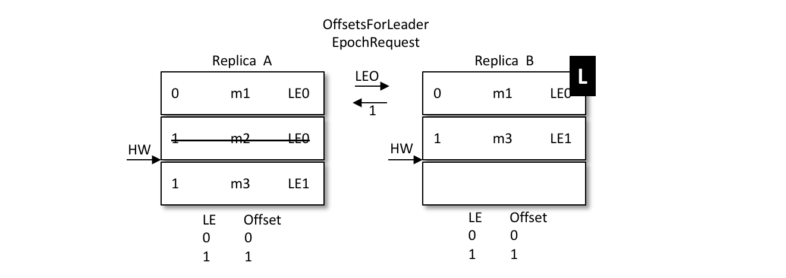
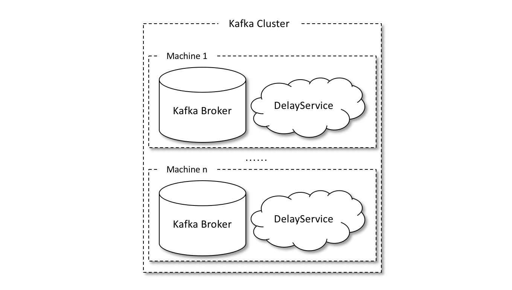

**

\- [消费再均衡的原理是什么？](#消费再均衡的原理是什么)

​    \- [第一阶段（FIND_COORDINATOR）](#第一阶段find_coordinator)

​    \- [第二阶段（JOIN_GROUP）](#第二阶段join_group)

​    \- [第三阶段（SYNC_GROUP）](#第三阶段sync_group)

​    \- [第四阶段（HEARTBEAT）](#第四阶段heartbeat)

\- [Kafka中的幂等是怎么实现的](#kafka中的幂等是怎么实现的)

\- [Kafka中的事务是怎么实现的，这题我去面试6家被问4次，](#kafka中的事务是怎么实现这题我去面试6家被问4次)

\- [失效副本是指什么？有那些应对措施？](#失效副本是指什么有那些应对措施)

​    \- [应对措施](#应对措施)

\- [多副本下，各个副本中的HW和LEO的演变过程](#多副本下各个副本中的hw和leo的演变过程)

\- [Kafka在可靠性方面做了哪些改进？（HW, LeaderEpoch）](#kafka在可靠性方面做了哪些改进hw-leaderepoch)

​    \- [HW](#hw)

​    \- [leader epoch](#leader-epoch)

\- [为什么Kafka不支持读写分离？](#为什么kafka不支持读写分离)

\- [Kafka中的延迟队列怎么实现](#kafka中的延迟队列怎么实现)

\- [Kafka中怎么实现死信队列和重试队列？](#kafka中怎么实现死信队列和重试队列)

\- [Kafka中怎么做消息审计？](#kafka中怎么做消息审计)

\- [Kafka中怎么做消息轨迹？](#kafka中怎么做消息轨迹)

\- [怎么计算Lag？(注意read_uncommitted和read_committed状态下的不同)](#怎么计算lag注意read_uncommitted和read_committed状态下的不同)

\- [Kafka有哪些指标需要着重关注？](#kafka有哪些指标需要着重关注)

\- [Kafka的那些设计让它有如此高的性能？](#kafka的那些设计让它有如此高的性能)

**

#### 消费再均衡的原理是什么？

就目前而言，一共有如下几种情形会触发再均衡的操作：

- 有新的消费者加入消费组。
- 有消费者宕机下线。消费者并不一定需要真正下线，例如遇到长时间的GC、网络延迟导致消费者长时间未向 GroupCoordinator 发送心跳等情况时，GroupCoordinator 会认为消费者已经下线。
- 有消费者主动退出消费组（发送 LeaveGroupRequest 请求）。比如客户端调用了 unsubscrible() 方法取消对某些主题的订阅。
- 消费组所对应的 GroupCoorinator 节点发生了变更。
- 消费组内所订阅的任一主题或者主题的分区数量发生变化。

GroupCoordinator 是 Kafka 服务端中用于管理消费组的组件。而消费者客户端中的 ConsumerCoordinator 组件负责与 GroupCoordinator 进行交互。

#### 

#### 第一阶段（FIND_COORDINATOR）

消费者需要确定它所属的消费组对应的 GroupCoordinator 所在的 broker，并创建与该 broker  相互通信的网络连接。如果消费者已经保存了与消费组对应的 GroupCoordinator  节点的信息，并且与它之间的网络连接是正常的，那么就可以进入第二阶段。否则，就需要向集群中的某个节点发送  FindCoordinatorRequest 请求来查找对应的  GroupCoordinator，这里的“某个节点”并非是集群中的任意节点，而是负载最小的节点。

#### 第二阶段（JOIN_GROUP）

在成功找到消费组所对应的 GroupCoordinator 之后就进入加入消费组的阶段，在此阶段的消费者会向 GroupCoordinator 发送 JoinGroupRequest 请求，并处理响应。

选举消费组的leader
 如果消费组内还没有 leader，那么第一个加入消费组的消费者即为消费组的 leader。如果某一时刻 leader 消费者由于某些原因退出了消费组，那么会重新选举一个新的 leader

选举分区分配策略

1. 收集各个消费者支持的所有分配策略，组成候选集 candidates。
2. 每个消费者从候选集 candidates 中找出第一个自身支持的策略，为这个策略投上一票。
3. 计算候选集中各个策略的选票数，选票数最多的策略即为当前消费组的分配策略。

#### 第三阶段（SYNC_GROUP）

leader 消费者根据在第二阶段中选举出来的分区分配策略来实施具体的分区分配，在此之后需要将分配的方案同步给各个消费者，通过 GroupCoordinator 这个“中间人”来负责转发同步分配方案的。
 

#### 第四阶段（HEARTBEAT）

进入这个阶段之后，消费组中的所有消费者就会处于正常工作状态。在正式消费之前，消费者还需要确定拉取消息的起始位置。假设之前已经将最后的消费位移提交到了 GroupCoordinator，并且 GroupCoordinator 将其保存到了 Kafka 内部的  __consumer_offsets 主题中，此时消费者可以通过 OffsetFetchRequest  请求获取上次提交的消费位移并从此处继续消费。

消费者通过向 GroupCoordinator  发送心跳来维持它们与消费组的从属关系，以及它们对分区的所有权关系。只要消费者以正常的时间间隔发送心跳，就被认为是活跃的，说明它还在读取分区中的消息。心跳线程是一个独立的线程，可以在轮询消息的空档发送心跳。如果消费者停止发送心跳的时间足够长，则整个会话就被判定为过期，GroupCoordinator 也会认为这个消费者已经死亡，就会触发一次再均衡行为。

#### Kafka中的幂等是怎么实现的

为了实现生产者的幂等性，Kafka 为此引入了 producer id（以下简称 PID）和序列号（sequence number）这两个概念。

每个新的生产者实例在初始化的时候都会被分配一个 PID，这个 PID 对用户而言是完全透明的。对于每个  PID，消息发送到的每一个分区都有对应的序列号，这些序列号从0开始单调递增。生产者每发送一条消息就会将 <PID，分区>  对应的序列号的值加1。

broker 端会在内存中为每一对 <PID，分区>  维护一个序列号。对于收到的每一条消息，只有当它的序列号的值（SN_new）比 broker 端中维护的对应的序列号的值（SN_old）大1（即  SN_new = SN_old + 1）时，broker 才会接收它。如果 SN_new< SN_old +  1，那么说明消息被重复写入，broker 可以直接将其丢弃。如果 SN_new> SN_old +  1，那么说明中间有数据尚未写入，出现了乱序，暗示可能有消息丢失，对应的生产者会抛出  OutOfOrderSequenceException，这个异常是一个严重的异常，后续的诸如  send()、beginTransaction()、commitTransaction() 等方法的调用都会抛出  IllegalStateException 的异常。

#### Kafka中的事务是怎么实现的（这题我去面试6家被问4次，照着答案念也要念十几分钟，面试官简直凑不要脸。

Kafka中的事务可以使应用程序将消费消息、生产消息、提交消费位移当作原子操作来处理，同时成功或失败，即使该生产或消费会跨多个分区。

生产者必须提供唯一的transactionalId，启动后请求事务协调器获取一个PID，transactionalId与PID一一对应。

每次发送数据给<Topic,  Partition>前，需要先向事务协调器发送AddPartitionsToTxnRequest，事务协调器会将该<Transaction, Topic, Partition>存于__transaction_state内，并将其状态置为BEGIN。

在处理完 AddOffsetsToTxnRequest 之后，生产者还会发送 TxnOffsetCommitRequest 请求给  GroupCoordinator，从而将本次事务中包含的消费位移信息 offsets 存储到主题 __consumer_offsets 中

一旦上述数据写入操作完成，应用程序必须调用KafkaProducer的commitTransaction方法或者abortTransaction方法以结束当前事务。无论调用 commitTransaction() 方法还是 abortTransaction() 方法，生产者都会向  TransactionCoordinator 发送 EndTxnRequest 请求。
 TransactionCoordinator 在收到 EndTxnRequest 请求后会执行如下操作：

1. 将 PREPARE_COMMIT 或 PREPARE_ABORT 消息写入主题 __transaction_state
2. 通过 WriteTxnMarkersRequest 请求将 COMMIT 或 ABORT 信息写入用户所使用的普通主题和 __consumer_offsets
3. 将 COMPLETE_COMMIT 或 COMPLETE_ABORT 信息写入内部主题 __transaction_state标明该事务结束

在消费端有一个参数isolation.level，设置为“read_committed”，表示消费端应用不可以看到尚未提交的事务内的消息。如果生产者开启事务并向某个分区值发送3条消息 msg1、msg2 和 msg3，在执行 commitTransaction() 或 abortTransaction()  方法前，设置为“read_committed”的消费端应用是消费不到这些消息的，不过在 KafkaConsumer  内部会缓存这些消息，直到生产者执行 commitTransaction() 方法之后它才能将这些消息推送给消费端应用。反之，如果生产者执行了  abortTransaction() 方法，那么 KafkaConsumer 会将这些缓存的消息丢弃而不推送给消费端应用。

### 失效副本是指什么？有那些应对措施？

正常情况下，分区的所有副本都处于 ISR 集合中，但是难免会有异常情况发生，从而某些副本被剥离出 ISR 集合中。在 ISR  集合之外，也就是处于同步失效或功能失效（比如副本处于非存活状态）的副本统称为失效副本，失效副本对应的分区也就称为同步失效分区，即  under-replicated 分区。

Kafka 从 0.9.x 版本开始就通过唯一的 broker 端参数 replica.lag.time.max.ms 来抉择，当 ISR 集合中的一个 follower 副本滞后 leader 副本的时间超过此参数指定的值时则判定为同步失败，需要将此 follower 副本剔除出 ISR 集合。replica.lag.time.max.ms 参数的默认值为10000。

在 0.9.x 版本之前，Kafka 中还有另一个参数  replica.lag.max.messages（默认值为4000），它也是用来判定失效副本的，当一个 follower 副本滞后 leader 副本的消息数超过 replica.lag.max.messages 的大小时，则判定它处于同步失效的状态。它与  replica.lag.time.max.ms 参数判定出的失效副本取并集组成一个失效副本的集合，从而进一步剥离出分区的 ISR 集合。

Kafka 源码注释中说明了一般有这几种情况会导致副本失效：

- follower 副本进程卡住，在一段时间内根本没有向 leader 副本发起同步请求，比如频繁的 Full GC。
- follower 副本进程同步过慢，在一段时间内都无法追赶上 leader 副本，比如 I/O 开销过大。
- 如果通过工具增加了副本因子，那么新增加的副本在赶上 leader 副本之前也都是处于失效状态的。
- 如果一个 follower 副本由于某些原因（比如宕机）而下线，之后又上线，在追赶上 leader 副本之前也处于失效状态。

#### 应对措施

我们用UnderReplicatedPartitions代表leader副本在当前Broker上且具有失效副本的分区的个数。

如果集群中有多个Broker的UnderReplicatedPartitions保持一个大于0的稳定值时，一般暗示着集群中有Broker已经处于下线状态。这种情况下，这个Broker中的分区个数与集群中的所有UnderReplicatedPartitions（处于下线的Broker是不会上报任何指标值的）之和是相等的。通常这类问题是由于机器硬件原因引起的，但也有可能是由于操作系统或者JVM引起的 。

如果集群中存在Broker的UnderReplicatedPartitions频繁变动，或者处于一个稳定的大于0的值（这里特指没有Broker下线的情况）时，一般暗示着集群出现了性能问题，通常这类问题很难诊断，不过我们可以一步一步的将问题的范围缩小，比如先尝试确定这个性能问题是否只存在于集群的某个Broker中，还是整个集群之上。如果确定集群中所有的under-replicated分区都是在单个Broker上，那么可以看出这个Broker出现了问题，进而可以针对这单一的Broker做专项调查，比如：操作系统、GC、网络状态或者磁盘状态（比如：iowait、ioutil等指标）。

### 多副本下，各个副本中的HW和LEO的演变过程

某个分区有3个副本分别位于 broker0、broker1 和 broker2 节点中，假设 broker0 上的副本1为当前分区的 leader 副本，那么副本2和副本3就是 follower 副本，整个消息追加的过程可以概括如下：

1. 生产者客户端发送消息至 leader 副本（副本1）中。
2. 消息被追加到 leader 副本的本地日志，并且会更新日志的偏移量。
3. follower 副本（副本2和副本3）向 leader 副本请求同步数据。
4. leader 副本所在的服务器读取本地日志，并更新对应拉取的 follower 副本的信息。
5. leader 副本所在的服务器将拉取结果返回给 follower 副本。
6. follower 副本收到 leader 副本返回的拉取结果，将消息追加到本地日志中，并更新日志的偏移量信息。

某一时刻，leader 副本的 LEO 增加至5，并且所有副本的 HW 还都为0。
 

之后 follower 副本（不带阴影的方框）向 leader 副本拉取消息，在拉取的请求中会带有自身的 LEO 信息，这个 LEO  信息对应的是 FetchRequest 请求中的 fetch_offset。leader 副本返回给 follower  副本相应的消息，并且还带有自身的 HW 信息，如上图（右）所示，这个 HW 信息对应的是 FetchResponse 中的  high_watermark。

此时两个 follower 副本各自拉取到了消息，并更新各自的 LEO 为3和4。与此同时，follower 副本还会更新自己的  HW，更新 HW 的算法是比较当前 LEO 和 leader 副本中传送过来的HW的值，取较小值作为自己的 HW 值。当前两个 follower 副本的 HW 都等于0（min(0,0) = 0）。

接下来 follower 副本再次请求拉取 leader 副本中的消息，如下图（左）所示。
 
 此时 leader 副本收到来自 follower 副本的 FetchRequest 请求，其中带有 LEO  的相关信息，选取其中的最小值作为新的 HW，即 min(15,3,4)=3。然后连同消息和 HW 一起返回 FetchResponse 给  follower 副本，如上图（右）所示。注意 leader 副本的 HW 是一个很重要的东西，因为它直接影响了分区数据对消费者的可见性。

两个 follower 副本在收到新的消息之后更新 LEO 并且更新自己的 HW 为3（min(LEO,3)=3）。

### Kafka在可靠性方面做了哪些改进？（HW, LeaderEpoch）

#### HW

HW 是 High Watermark 的缩写，俗称高水位，它标识了一个特定的消息偏移量（offset），消费者只能拉取到这个 offset 之前的消息。

分区 ISR 集合中的每个副本都会维护自身的 LEO，而 ISR 集合中最小的 LEO 即为分区的 HW，对消费者而言只能消费 HW 之前的消息。

#### leader epoch

leader epoch 代表 leader 的纪元信息（epoch），初始值为0。每当 leader 变更一次，leader epoch 的值就会加1，相当于为 leader 增设了一个版本号。
 每个副本中还会增设一个矢量 <LeaderEpoch => StartOffset>，其中 StartOffset 表示当前 LeaderEpoch 下写入的第一条消息的偏移量。

假设有两个节点A和B，B是leader节点，里面的数据如图：
 

A发生重启，之后A不是先忙着截断日志而是先发送OffsetsForLeaderEpochRequest请求给B，B作为目前的leader在收到请求之后会返回当前的LEO（LogEndOffset，注意图中LE0和LEO的不同），与请求对应的响应为OffsetsForLeaderEpochResponse。如果 A 中的 LeaderEpoch（假设为 LE_A）和 B 中的不相同，那么 B 此时会查找 LeaderEpoch 为 LE_A+1 对应的 StartOffset 并返回给 A
 

如上图所示，A 在收到2之后发现和目前的 LEO 相同，也就不需要截断日志了，以此来保护数据的完整性。

再如，之后 B 发生了宕机，A 成为新的 leader，那么对应的 LE=0 也变成了 LE=1，对应的消息 m2  此时就得到了保留。后续的消息都可以以 LE1 为 LeaderEpoch 陆续追加到 A  中。这个时候A就会有两个LE，第二LE所记录的Offset从2开始。如果B恢复了，那么就会从A中获取到LE+1的Offset为2的值返回给B。
 

再来看看LE如何解决数据不一致的问题：
 当前 A 为 leader，B 为 follower，A 中有2条消息 m1 和 m2，而 B 中有1条消息 m1。假设 A 和 B 同时“挂掉”，然后 B 第一个恢复过来并成为新的 leader。
 

之后 B 写入消息 m3，并将 LEO 和 HW 更新至2，如下图所示。注意此时的 LeaderEpoch 已经从 LE0 增至 LE1 了。
 

紧接着 A 也恢复过来成为 follower 并向 B 发送 OffsetsForLeaderEpochRequest 请求，此时 A 的 LeaderEpoch 为 LE0。B 根据 LE0 查询到对应的 offset 为1并返回给 A，A 就截断日志并删除了消息  m2，如下图所示。之后 A 发送 FetchRequest 至 B 请求来同步数据，最终A和B中都有两条消息 m1 和 m3，HW 和  LEO都为2，并且 LeaderEpoch 都为 LE1，如此便解决了数据不一致的问题。
 

### 为什么Kafka不支持读写分离？

因为这样有两个明显的缺点：

1. 数据一致性问题。数据从主节点转到从节点必然会有一个延时的时间窗口，这个时间窗口会导致主从节点之间的数据不一致。
2. 延时问题。数据从写入主节点到同步至从节点中的过程需要经历网络→主节点内存→主节点磁盘→网络→从节点内存→从节点磁盘这几个阶段。对延时敏感的应用而言，主写从读的功能并不太适用。

对于Kafka来说，必要性不是很高，因为在Kafka集群中，如果存在多个副本，经过合理的配置，可以让leader副本均匀的分布在各个broker上面，使每个 broker 上的读写负载都是一样的。

### Kafka中的延迟队列怎么实现

在发送延时消息的时候并不是先投递到要发送的真实主题（real_topic）中，而是先投递到一些 Kafka  内部的主题（delay_topic）中，这些内部主题对用户不可见，然后通过一个自定义的服务拉取这些内部主题中的消息，并将满足条件的消息再投递到要发送的真实的主题中，消费者所订阅的还是真实的主题。

如果采用这种方案，那么一般是按照不同的延时等级来划分的，比如设定5s、10s、30s、1min、2min、5min、10min、20min、30min、45min、1hour、2hour这些按延时时间递增的延时等级，延时的消息按照延时时间投递到不同等级的主题中，投递到同一主题中的消息的延时时间会被强转为与此主题延时等级一致的延时时间，这样延时误差控制在两个延时等级的时间差范围之内（比如延时时间为17s的消息投递到30s的延时主题中，之后按照延时时间为30s进行计算，延时误差为13s）。虽然有一定的延时误差，但是误差可控，并且这样只需增加少许的主题就能实现延时队列的功能。

发送到内部主题（delay_topic_*）中的消息会被一个独立的 DelayService 进程消费，这个 DelayService 进程和 Kafka broker 进程以一对一的配比进行同机部署（参考下图），以保证服务的可用性。
 

针对不同延时级别的主题，在 DelayService 的内部都会有单独的线程来进行消息的拉取，以及单独的 DelayQueue（这里用的是 JUC 中 DelayQueue）进行消息的暂存。与此同时，在 DelayService 内部还会有专门的消息发送线程来获取  DelayQueue 的消息并转发到真实的主题中。从消费、暂存再到转发，线程之间都是一一对应的关系。如下图所示，DelayService  的设计应当尽量保持简单，避免锁机制产生的隐患。
 

为了保障内部 DelayQueue 不会因为未处理的消息过多而导致内存的占用过大，DelayService 会对主题中的每个分区进行计数，当达到一定的阈值之后，就会暂停拉取该分区中的消息。

因为一个主题中一般不止一个分区，分区之间的消息并不会按照投递时间进行排序，DelayQueue的作用是将消息按照再次投递时间进行有序排序，这样下游的消息发送线程就能够按照先后顺序获取最先满足投递条件的消息。

### Kafka中怎么实现死信队列和重试队列？

死信可以看作消费者不能处理收到的消息，也可以看作消费者不想处理收到的消息，还可以看作不符合处理要求的消息。比如消息内包含的消息内容无法被消费者解析，为了确保消息的可靠性而不被随意丢弃，故将其投递到死信队列中，这里的死信就可以看作消费者不能处理的消息。再比如超过既定的重试次数之后将消息投入死信队列，这里就可以将死信看作不符合处理要求的消息。

重试队列其实可以看作一种回退队列，具体指消费端消费消息失败时，为了防止消息无故丢失而重新将消息回滚到 broker 中。与回退队列不同的是，重试队列一般分成多个重试等级，每个重试等级一般也会设置重新投递延时，重试次数越多投递延时就越大。

理解了他们的概念之后我们就可以为每个主题设置重试队列，消息第一次消费失败入重试队列 Q1，Q1 的重新投递延时为5s，5s过后重新投递该消息；如果消息再次消费失败则入重试队列 Q2，Q2 的重新投递延时为10s，10s过后再次投递该消息。

然后再设置一个主题作为死信队列，重试越多次重新投递的时间就越久，并且需要设置一个上限，超过投递次数就进入死信队列。重试队列与延时队列有相同的地方，都需要设置延时级别。

### Kafka中怎么做消息审计？

消息审计是指在消息生产、存储和消费的整个过程之间对消息个数及延迟的审计，以此来检测是否有数据丢失、是否有数据重复、端到端的延迟又是多少等内容。

目前与消息审计有关的产品也有多个，比如 Chaperone（Uber）、Confluent Control Center、Kafka  Monitor（LinkedIn），它们主要通过在消息体（value 字段）或在消息头（headers 字段）中内嵌消息对应的时间戳  timestamp 或全局的唯一标识 ID（或者是两者兼备）来实现消息的审计功能。

内嵌 timestamp 的方式主要是设置一个审计的时间间隔  time_bucket_interval（可以自定义设置几秒或几分钟），根据这个 time_bucket_interval 和消息所属的  timestamp 来计算相应的时间桶（time_bucket）。

内嵌 ID 的方式就更加容易理解了，对于每一条消息都会被分配一个全局唯一标识  ID。如果主题和相应的分区固定，则可以为每个分区设置一个全局的 ID。当有消息发送时，首先获取对应的 ID，然后内嵌到消息中，最后才将它发送到  broker 中。消费者进行消费审计时，可以判断出哪条消息丢失、哪条消息重复。

### Kafka中怎么做消息轨迹？

消息轨迹指的是一条消息从生产者发出，经由 broker  存储，再到消费者消费的整个过程中，各个相关节点的状态、时间、地点等数据汇聚而成的完整链路信息。生产者、broker、消费者这3个角色在处理消息的过程中都会在链路中增加相应的信息，将这些信息汇聚、处理之后就可以查询任意消息的状态，进而为生产环境中的故障排除提供强有力的数据支持。

对消息轨迹而言，最常见的实现方式是封装客户端，在保证正常生产消费的同时添加相应的轨迹信息埋点逻辑。无论生产，还是消费，在执行之后都会有相应的轨迹信息，我们需要将这些信息保存起来。

我们同样可以将轨迹信息保存到 Kafka 的某个主题中，比如下图中的主题 trace_topic。

 生产者在将消息正常发送到用户主题 real_topic 之后（或者消费者在拉取到消息消费之后）会将轨迹信息发送到主题 trace_topic 中。

### 怎么计算Lag？(注意read_uncommitted和read_committed状态下的不同)

如果消费者客户端的 isolation.level 参数配置为“read_uncommitted”（默认）,它对应的 Lag 等于HW – ConsumerOffset 的值，其中 ConsumerOffset 表示当前的消费位移。

如果这个参数配置为“read_committed”，那么就要引入 LSO 来进行计算了。LSO 是 LastStableOffset 的缩写,它对应的 Lag 等于 LSO – ConsumerOffset 的值。

- 首先通过 DescribeGroupsRequest 请求获取当前消费组的元数据信息，当然在这之前还会通过 FindCoordinatorRequest 请求查找消费组对应的 GroupCoordinator。
- 接着通过 OffsetFetchRequest 请求获取消费位移 ConsumerOffset。
- 然后通过 KafkaConsumer 的 endOffsets(Collection partitions)方法（对应于 ListOffsetRequest 请求）获取 HW（LSO）的值。
- 最后通过 HW 与 ConsumerOffset 相减得到分区的 Lag，要获得主题的总体 Lag 只需对旗下的各个分区累加即可。

### Kafka有哪些指标需要着重关注？

比较重要的 Broker 端 JMX 指标：

- BytesIn/BytesOut：即 Broker 端每秒入站和出站字节数。你要确保这组值不要接近你的网络带宽，否则这通常都表示网卡已被“打满”，很容易出现网络丢包的情形。
- NetworkProcessorAvgIdlePercent：即网络线程池线程平均的空闲比例。通常来说，你应该确保这个 JMX  值长期大于 30%。如果小于这个值，就表明你的网络线程池非常繁忙，你需要通过增加网络线程数或将负载转移给其他服务器的方式，来给该 Broker  减负。
- RequestHandlerAvgIdlePercent：即 I/O 线程池线程平均的空闲比例。同样地，如果该值长期小于 30%，你需要调整 I/O 线程池的数量，或者减少 Broker 端的负载。
- UnderReplicatedPartitions：即未充分备份的分区数。所谓未充分备份，是指并非所有的 Follower 副本都和  Leader 副本保持同步。一旦出现了这种情况，通常都表明该分区有可能会出现数据丢失。因此，这是一个非常重要的 JMX 指标。
- ISRShrink/ISRExpand：即 ISR 收缩和扩容的频次指标。如果你的环境中出现 ISR 中副本频繁进出的情形，那么这组值一定是很高的。这时，你要诊断下副本频繁进出 ISR 的原因，并采取适当的措施。
- ActiveControllerCount：即当前处于激活状态的控制器的数量。正常情况下，Controller 所在 Broker  上的这个 JMX 指标值应该是 1，其他 Broker 上的这个值是 0。如果你发现存在多台 Broker 上该值都是 1  的情况，一定要赶快处理，处理方式主要是查看网络连通性。这种情况通常表明集群出现了脑裂。脑裂问题是非常严重的分布式故障，Kafka 目前依托  ZooKeeper 来防止脑裂。但一旦出现脑裂，Kafka 是无法保证正常工作的。

### Kafka的那些设计让它有如此高的性能？

1. 分区
    kafka是个分布式集群的系统，整个系统可以包含多个broker，也就是多个服务器实例。每个主题topic会有多个分区，kafka将分区均匀地分配到整个集群中，当生产者向对应主题传递消息，消息通过负载均衡机制传递到不同的分区以减轻单个服务器实例的压力。

一个Consumer Group中可以有多个consumer，多个consumer可以同时消费不同分区的消息，大大的提高了消费者的并行消费能力。但是一个分区中的消息只能被一个Consumer Group中的一个consumer消费。

1. 网络传输上减少开销
    批量发送：
    在发送消息的时候，kafka不会直接将少量数据发送出去，否则每次发送少量的数据会增加网络传输频率，降低网络传输效率。kafka会先将消息缓存在内存中，当超过一个的大小或者超过一定的时间，那么会将这些消息进行批量发送。
    端到端压缩：
    当然网络传输时数据量小也可以减小网络负载，kafaka会将这些批量的数据进行压缩，将一批消息打包后进行压缩，发送broker服务器后，最终这些数据还是提供给消费者用，所以数据在服务器上还是保持压缩状态，不会进行解压，而且频繁的压缩和解压也会降低性能，最终还是以压缩的方式传递到消费者的手上。
2. 顺序读写
    kafka将消息追加到日志文件中，利用了磁盘的顺序读写，来提高读写效率。
3. 零拷贝技术

零拷贝将文件内容从磁盘通过DMA引擎复制到内核缓冲区，而且没有把数据复制到socket缓冲区，只是将数据位置和长度信息的描述符复制到了socket缓存区，然后直接将数据传输到网络接口，最后发送。这样大大减小了拷贝的次数，提高了效率。kafka正是调用linux系统给出的sendfile系统调用来使用零拷贝。Java中的系统调用给出的是FileChannel.transferTo接口。

1. 优秀的文件存储机制
    如果分区规则设置得合理，那么所有的消息可以均匀地分布到不同的分区中，这样就可以实现水平扩展。不考虑多副本的情况，一个分区对应一个日志（Log）。为了防止 Log 过大，Kafka 又引入了日志分段（LogSegment）的概念，将 Log 切分为多个  LogSegment，相当于一个巨型文件被平均分配为多个相对较小的文件，这样也便于消息的维护和清理。

Kafka 中的索引文件以稀疏索引（sparse  index）的方式构造消息的索引，它并不保证每个消息在索引文件中都有对应的索引项。每当写入一定量（由 broker 端参数  log.index.interval.bytes 指定，默认值为4096，即  4KB）的消息时，偏移量索引文件和时间戳索引文件分别增加一个偏移量索引项和时间戳索引项，增大或减小  log.index.interval.bytes 的值，对应地可以增加或缩小索引项的密度。