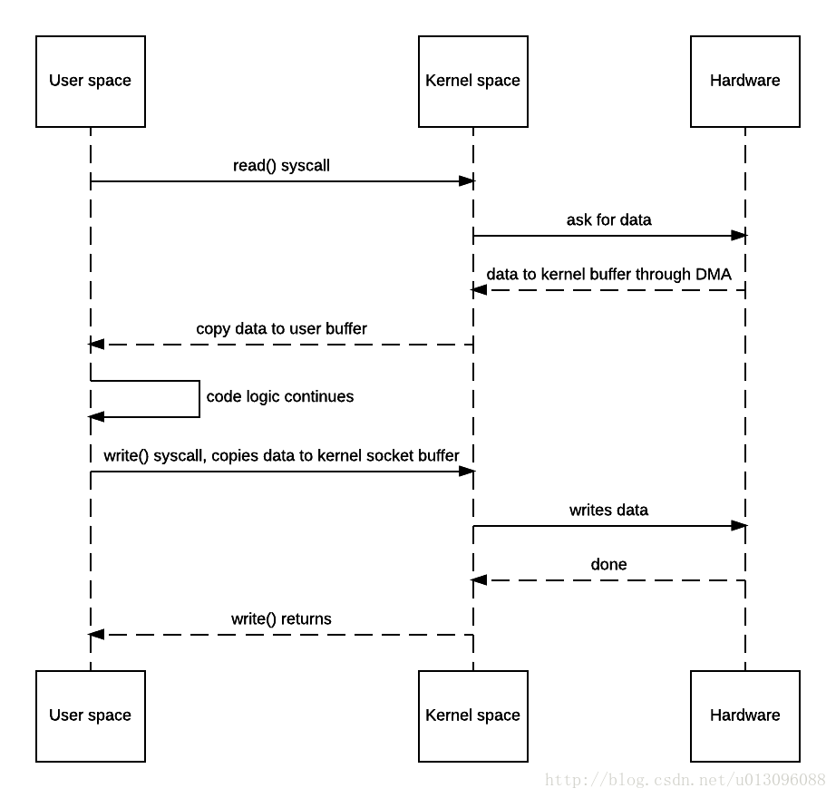
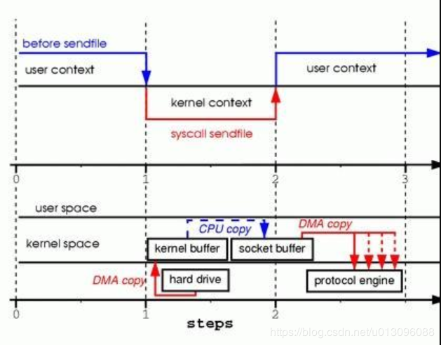
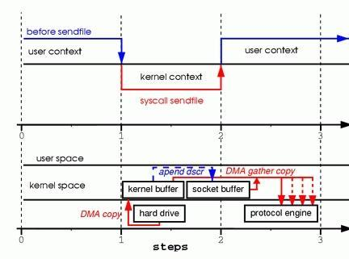
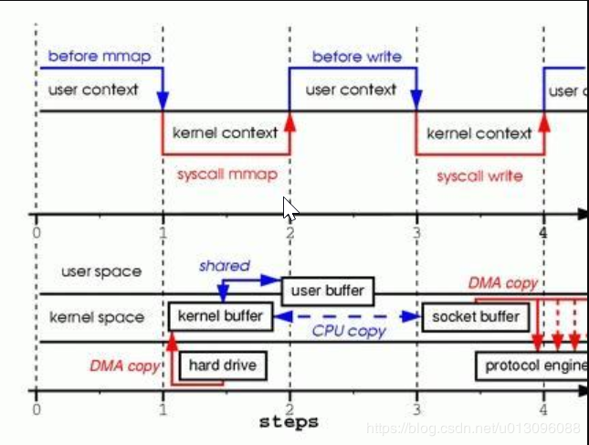

### 零拷贝
#### 什么是零拷贝
维基上是这么描述零拷贝的：零拷贝描述的是CPU不执行拷贝数据从一个存储区域到另一个存储区域的任务，这通常用于通过网络传输一个文件时以减少CPU周期和内存带宽。

**零拷贝给我们带来的好处**
减少甚至完全避免不必要的CPU拷贝，从而让CPU解脱出来去执行其他的任务
减少内存带宽的占用
通常零拷贝技术还能够减少用户空间和操作系统内核空间之间的上下文切换
#### 零拷贝的实现
零拷贝实际的实现并没有真正的标准，取决于操作系统如何实现这一点。零拷贝完全依赖于操作系统。操作系统支持，就有；不支持，就没有。不依赖Java本身。

#### 传统I/O
在Java中，我们可以通过InputStream从源数据中读取数据流到一个缓冲区里，然后再将它们输入到OutputStream里。我们知道，这种IO方式传输效率是比较低的。那么，当使用上面的代码时操作系统会发生什么情况：

1. JVM发出read() 系统调用。
2. OS上下文切换到内核模式（第一次上下文切换）并将数据读取到内核空间缓冲区。(第一次拷贝：hardware ----> **kernel buffer**）
3. OS内核然后将数据复制到用户空间缓冲区(第二次拷贝: kernel buffer ——> user buffer)，然后read系统调用返回。而系统调用的返回又会导致一次内核空间到用户空间的上下文切换(第二次上下文切换)。
4. JVM处理代码逻辑并发送write（）系统调用。
5. OS上下文切换到内核模式(第三次上下文切换)并从用户空间缓冲区复制数据到内核空间缓冲区(第三次拷贝: user buffer ——> kernel buffer)。
6. write系统调用返回，导致内核空间到用户空间的再次上下文切换(第四次上下文切换)。将内核空间缓冲区中的数据写到hardware(第四次拷贝: kernel buffer ——> hardware)。

总的来说，传统的I/O操作进行了4次用户空间与内核空间的上下文切换，以及4次数据拷贝。显然在这个用例中，从内核空间到用户空间内存的复制是完全不必要的，因为除了将数据转储到不同的buffer之外，我们没有做任何其他的事情。所以，我们能不能直接从hardware读取数据到kernel buffer后，再从kernel buffer写到目标地点不就好了。为了解决这种不必要的数据复制，操作系统出现了零拷贝的概念。注意，不同的操作系统对零拷贝的实现各不相同。在这里我们介绍linux下的零拷贝实现。

#### 通过sendfile实现的零拷贝I/O

1. 发出sendfile系统调用，导致用户空间到内核空间的上下文切换(第一次上下文切换)。通过DMA将磁盘文件中的内容拷贝到内核空间缓冲区中(第一次拷贝: hard driver ——> kernel buffer)。
2. 然后再将数据从内核空间缓冲区拷贝到内核中与socket相关的缓冲区中(第二次拷贝: kernel buffer ——> socket buffer)。
3. sendfile系统调用返回，导致内核空间到用户空间的上下文切换(第二次上下文切换)。通过DMA引擎将内核空间socket缓冲区中的数据传递到协议引擎(第三次拷贝: socket buffer ——> protocol engine)。
4. 通过sendfile实现的零拷贝I/O只使用了2次用户空间与内核空间的上下文切换，以及3次数据的拷贝。
5. 你可能会说操作系统仍然需要在内核内存空间中复制数据（kernel buffer —>socket buffer）。 是的，但从操作系统的角度来看，这已经是零拷贝，因为没有数据从内核空间复制到用户空间。 内核需要复制的原因是因为通用硬件**DMA**访问需要连续的内存空间（因此需要缓冲区）。 但是，如果硬件支持scatter-and-gather，这是可以避免的。

#### 带有DMA收集拷贝功能的sendfile实现的I/O

1. 发出sendfile系统调用，导致用户空间到内核空间的上下文切换(第一次上下文切换)。通过DMA引擎将磁盘文件中的内容拷贝到内核空间缓冲区中(第一次拷贝: hard drive ——> kernel buffer)。
2. 没有数据拷贝到socket缓冲区。取而代之的是只有相应的描述符信息会被拷贝到相应的socket缓冲区当中。该描述符包含了两方面的信息：a)kernel buffer的内存地址；b)kernel buffer的偏移量。
3. sendfile系统调用返回，导致内核空间到用户空间的上下文切换(第二次上下文切换)。DMA gather copy根据socket缓冲区中描述符提供的位置和偏移量信息直接将内核空间缓冲区中的数据拷贝到协议引擎上(第二次拷贝: kernel buffer ——> protocol engine)，这样就避免了最后一次CPU数据拷贝。
4. 带有DMA收集拷贝功能的sendfile实现的I/O只使用了2次用户空间与内核空间的上下文切换，以及2次数据的拷贝，而且这2次的数据拷贝都是非CPU拷贝。这样一来我们就实现了最理想的零拷贝I/O传输了，不需要任何一次的CPU拷贝，以及最少的上下文切换。

许多Web服务器都支持零拷贝，如Tomcat和Apache。 例如Apache的相关文档可以在这里找到，但默认情况下关闭。
注意：**Java的NIO通过transferTo（）提供了这个功能。**

传统I/O用户空间缓冲区中存有数据，因此应用程序能够对此数据进行修改等操作；而sendfile零拷贝消除了所有内核空间缓冲区与用户空间缓冲区之间的数据拷贝过程，因此sendfile零拷贝I/O的实现是完成在内核空间中完成的，这对于应用程序来说就无法对数据进行操作了。为了解决这个问题，Linux提供了mmap零拷贝来实现我们的需求。

#### 通过mmap实现的零拷贝I/O

**mmap(内存映射)是一个比sendfile昂贵但优于传统I/O的方法。**

1. 发出mmap系统调用，导致用户空间到内核空间的上下文切换(第一次上下文切换)。通过DMA引擎将磁盘文件中的内容拷贝到内核空间缓冲区中(第一次拷贝: hard drive ——> kernel buffer)。
2. mmap系统调用返回，导致内核空间到用户空间的上下文切换(第二次上下文切换)。接着用户空间和内核空间共享这个缓冲区，而不需要将数据从内核空间拷贝到用户空间。因为用户空间和内核空间共享了这个缓冲区数据，所以用户空间就可以像在操作自己缓冲区中数据一般操作这个由内核空间共享的缓冲区数据。
3. 发出write系统调用，导致用户空间到内核空间的上下文切换(第三次上下文切换)。将数据从内核空间缓冲区拷贝到内核空间socket相关联的缓冲区(第二次拷贝: kernel buffer ——> socket buffer)。
4. write系统调用返回，导致内核空间到用户空间的上下文切换(第四次上下文切换)。通过DMA引擎将内核空间socket缓冲区中的数据传递到协议引擎(第三次拷贝: socket buffer ——> protocol engine)
5. 通过mmap实现的零拷贝I/O进行了4次用户空间与内核空间的上下文切换，以及3次数据拷贝。其中3次数据拷贝中包括了2次DMA拷贝和1次CPU拷贝。明显，它与传统I/O相比仅仅少了1次内核空间缓冲区和用户空间缓冲区之间的CPU拷贝。这样的好处是，我们可以将整个文件或者整个文件的一部分映射到内存当中，用户直接对内存中对文件进行操作，然后是由操作系统来进行相关的页面请求并将内存的修改写入到文件当中。我们的应用程序只需要处理内存的数据，这样可以实现非常迅速的I/O操作。

说了这么多，那么Java NIO中对零拷贝的使用有哪些呢？

#### NIO DirectByteBuffer
Java NIO引入了用于通道的缓冲区的ByteBuffer。 ByteBuffer有三个主要的实现：

 **HeapByteBuffer**
在调用ByteBuffer.allocate()时使用。 它被称为堆，因为它保存在JVM的堆空间中，因此你可以获得所有优势，如GC支持和缓存优化。 但是，它不是页面对齐的，这意味着如果你需要通过JNI与本地代码交谈，JVM将不得不复制到对齐的缓冲区空间。

**DirectByteBuffer**
在调用ByteBuffer.allocateDirect()时使用。 JVM将使用malloc()在堆空间之外分配内存空间。 因为它不是由JVM管理的，所以你的内存空间是页面对齐的，不受GC影响，这使得它成为处理本地代码的完美选择。 然而，你要C程序员一样，自己管理这个内存，必须自己分配和释放内存来防止内存泄漏。

**MappedByteBuffer**
在调用FileChannel.map()时使用。 与DirectByteBuffer类似，这也是JVM堆外部的情况。 它基本上作为OS mmap()系统调用的包装函数，以便代码直接操作映射的物理内存数据。

#### 总结
零拷贝是操作系统底层的一种实现，我们在网络编程中，利用操作系统这一特性，可以大大提高数据传输的效率。这也是目前网络编程框架中都会采用的方式，理解好零拷贝，有助于我们进一步学习Netty等网络通信框架的底层原理。

参考
[It’s all about buffers: zero-copy, mmap and Java NIO](http://xcorpion.tech/2016/09/10/It-s-all-about-buffers-zero-copy-mmap-and-Java-NIO/)
[浅谈 Linux下的零拷贝机制](https://www.jianshu.com/p/e76e3580e356)
[圣思园《精通并发与Netty》](http://www.iprogramming.cn/netty.html)

来源：https://blog.csdn.net/u013096088/article/details/79122671