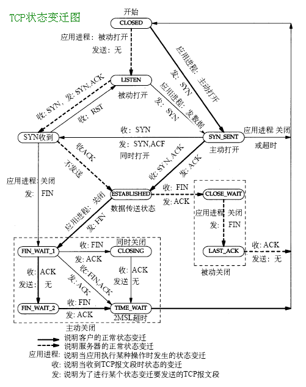
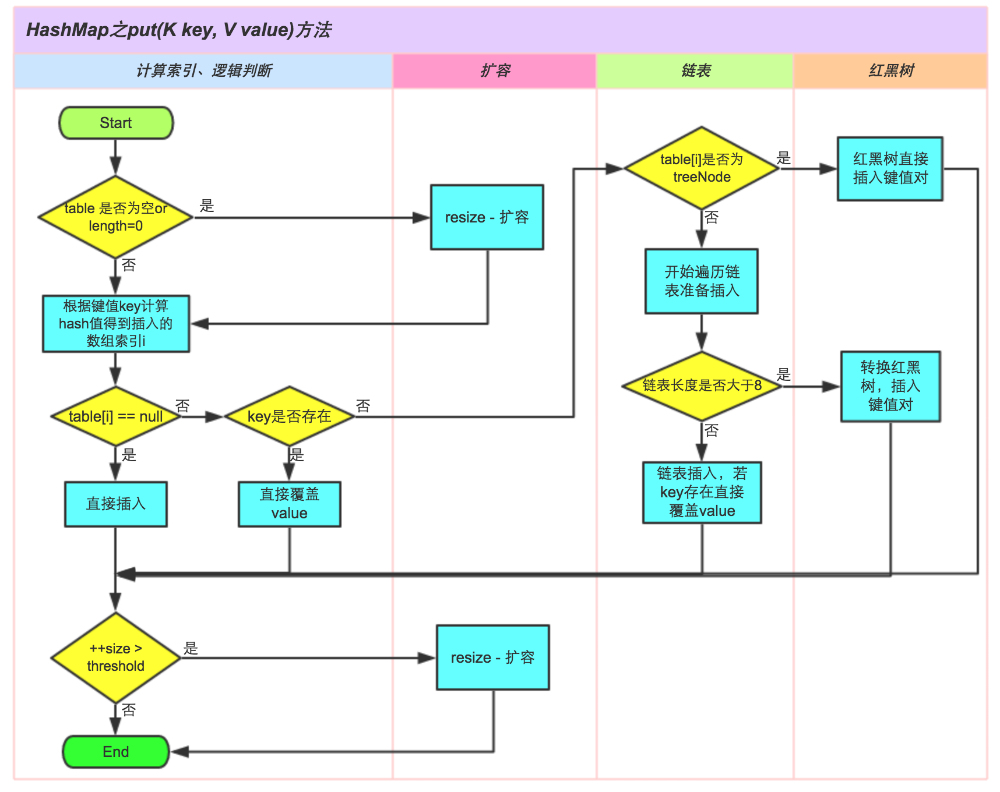
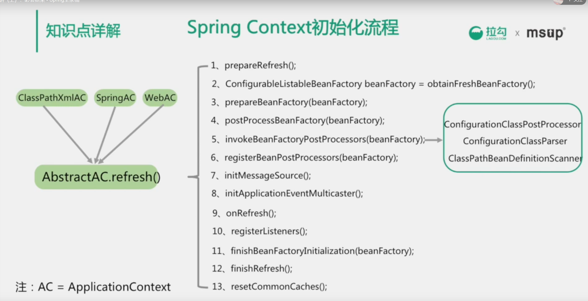
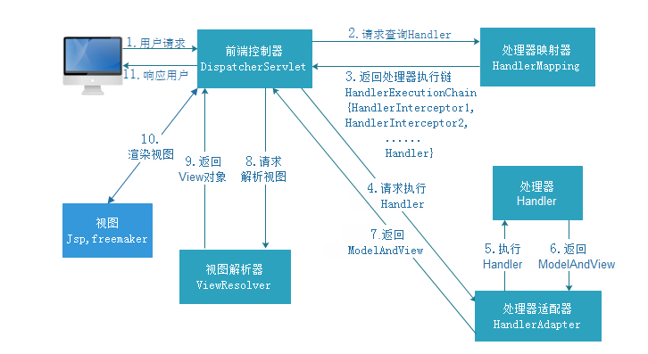
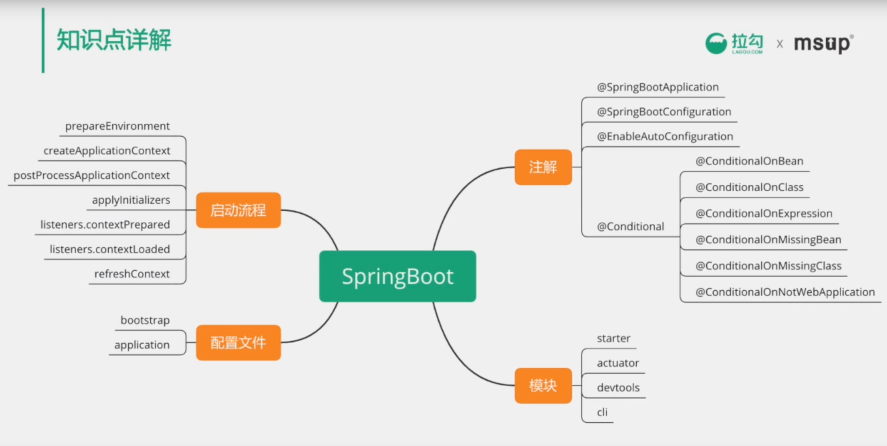
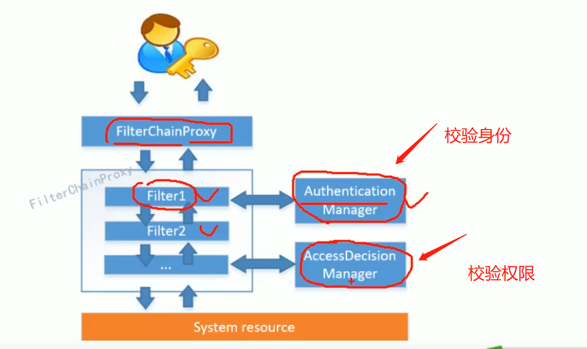
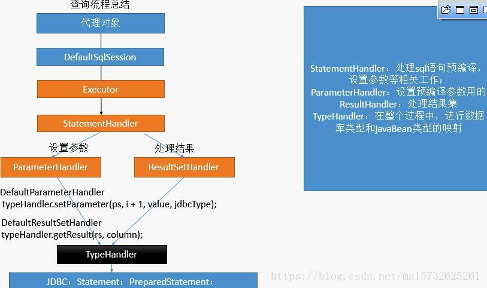
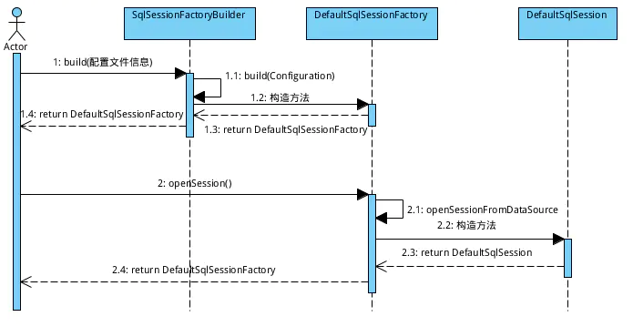
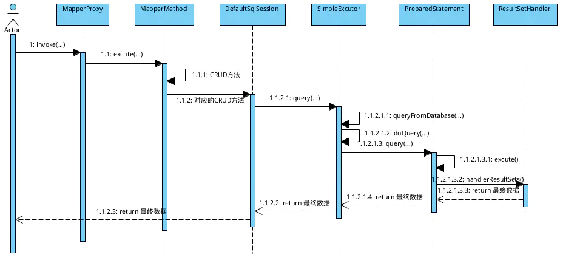

[](https://gitee.com/Eric125/boot-mybatis) [](https://gitee.com/Eric125/boot-mybatis) [](https://gitee.com/Eric125/boot-mybatis/master/LICENSE) [](https://app.codacy.com/app/Eric125/boot-mybatis?utm_source=github.com&utm_medium=referral&utm_content=Eric125/boot-mybatis&utm_campaign=Badge_Grade_Dashboard)


------

<!-- TOC -->

- [面试准备](#面试准备)
    - [基础](#基础)
        - [网络](#网络)
        - [算法](#算法)
        - [设计模式](#设计模式)
    - [java](#java)
        - [**jvm相关面试题**](#jvm相关面试题)
        - [collection相关面试题](#collection相关面试题)
        - [spring相关面试题](#spring相关面试题)
        - [mybatis相关面试题](#mybatis相关面试题)
        - [dubbo相关面试题](#dubbo相关面试题)
    - [组件](#组件)
        - [mysql 相关面试题](#mysql-相关面试题)
        - [redis相关面试题](#redis相关面试题)
        - [elasticsearch相关面试题](#elasticsearch相关面试题)
        - [kafka相关面试题](#kafka相关面试题)
        - [netty相关面试题](#netty相关面试题)
        - [git相关面试题](#git相关面试题)
    - [项目相关](#项目相关)

<!-- /TOC -->


### 面试准备


#### 基础
##### 网络

> 基于网络的面试题，主要搞清楚两个点`TCP`,`UDP`，然后就是通用的基础知识点比方说`4/7层网络模型`,`Http`相关知识点，这块可以通过 [JavaGuide](https://gitee.com/SnailClimb/JavaGuide/tree/master)来 详细学习，javaGuide上面讲的基础知识还是挺全面的

TCP/IP四层协议：应用层（SMTP,FTP,Telnet），传输层（TCP/UDP）,网络层（IP）,网络接口层

OSI七层：应用层，表现层，会话层，传输层，网络层，数据链路层，物理层

1. **TCP特点:** 
   
   1. 基于链接(点对点)
   2. 双工通道
   3. 可靠传输（三次握手四次挥手）
   4. 拥塞控制
   5. 基于字节流而非报文
   
   [tcp怎么保证有序传输，tcp快速重传和拥塞机制](note/topic/network/tcp保证传输可靠性.md)
   
2. **TCP实现细节：**
   
   1. 8种报文状态
   
      
   
   2. 滑动窗口机制
   
   3. KeepAlive
   
   4. Nagel算法
   
3. **UDP特点:**
   1. 非链接
   2. 非可靠传输
   3. 效率高   
   

##### 算法

1. 常用排序算法能够白班写出来 （根据执行效率从前到后）   

   **冒泡排序，选择排序，插入排序，希尔排序，归并排序，快速排序**
   [详情](algorithm/readme.md)

##### 设计模式

1. 白班编写常用设计模式

2. 能够熟悉`工厂模式`,`抽象工厂模式`,`命令模式`,`适配器模式`,`过滤器模式`

   

#### java

java基础

1. **语法**

2. **动态**

   反射讲一讲，主要概念都在哪需要反射机制，反射的性能，如何优化？

##### **jvm相关面试题**

> 对于jvm更多是考察的我们的知识面，以及面试高级工程师的时候会用到的知识点，虽然比较鸡肋，但是对于理解java执行过程，以及性能调优的时候提供了一种可行的执行方案。这里有一副[脑图](note/etc/mind/jvm.xmind) ,配合学习

1. **类加载机制**
   
   > 类加载机制的基础是双亲委派模式，进阶版就是理解tomcat违背了双清委派模式，它是如何实现的，实现细节是什么样子的，为什么这样实现，有什么好处等等相关面试题

   - 描述一下JVM加载Class文件的原理(类加载过程)？
   
     [类加载流程](note/topic/java/jvm/1-7jvm流程.md#类加载过程)
   
   - 什么是类加载机制？
     `双清委派模式` 结合java类加载器一起讲解
   
   - JAVA 类加载器？
   
     [类加载器](note/topic/java/jvm/1-7jvm流程.md#类加载器)
   
   - 什么是tomcat类加载机制？
   
     [tomcat类加载器](note/topic/java/jvm/1-7jvm流程.md#类加载器)
   
2. **GC**

   > `GC`相关面试题从如何判定对象已经死亡，使用的GC算法，以及垃圾收集器，最好的，我们能够将`设置GC参数`相关的点都能够拓展的答出来

   - 怎么判断对象是否可 GC？Java 对象有哪些引用类型？有什么区别？

     判断对象是否可以GC,目前有两种方式，一种是`引用计数法`，一种是`可达性分析`，java中使用的是后者，前者对于循环引用的对象没有办法回收，

     java对象引用类型有这么几种： **强引用**，**软引用**，**虚引用**，**弱引用**，他们之前的区别主要是垃圾回收机制对于他们回收的优先顺序，强引用的都不会被回收，以此类推

   - 说下你知道的垃圾收集器

   - OOM 出现的有哪些场景？为什么会发生？

   - 怎么判断对象是否可 GC？Java 对象有哪些引用类型？有什么区别？

   - 说下你知道的垃圾回收算法

   - Minor GC 和 Full GC 有什么区别？分析过 GC 日志吗？

   - CMS 和 G1 的区别知道吗？使用场景分别是？你项目中用的是哪个？

   - 什么是分布式垃圾回收机制

   

3. **内存模型**

   > 这个点，需要和`内存区域`区别开来，同时可以和juc相关的点联系在一起回答，特别是`volatile`关键字，以及`final`关键字在java内存模型中的优化，以及线程调度与状态转换的过程。

  - 什么是java内存模型？

    [内存模型](note/topic/java/jvm/14.java内存模型.md)

4. **内存区域**

   > 这个比较简单，我们只需要回答上`方法区`,`堆`,`栈`,`本地方法栈`这几种内存区域中分别存放那种类型的数据即可

   - Java 内存结构（注：不是 Java 内存模型，别搞混）
     [内存分配](note/topic/java/jvm/8.内存分配.md)

5. **性能分析工具**

   > 了解常用的JVM参数，和性能分析工具的使用，`MAT`,`JMC`,`Jstack`等

6. **线上问题分析**

   - 假如线上服务发生 OOM，有哪些措施可以找到问题？

   - 假如线上服务 CPU 很高该怎么做？有哪些措施可以找到问题？

   - 假如线上应用频繁发生 Full GC，有哪些措施可以找到问题？

     这个问题其实也是考验Full GC 发生的条件，

   - 一般线上环境遇到 JVM 问题，你会使用哪些工具来分析？

     
   
   - 找到问题后又该如何去解决呢？
   
   

 ##### 并发相关面试题(topic里面的内容还不够系统)

> 并发考察是对实际并发场景的应用，可以和线程`Thread`以及`Thread`行为组织起来，比方说线程的六种状态(New,Runnable,Blocked,Waiting,Timed_Waiting,Terminated)以及其相互转化的过程，线程之间的通信(wait,notify notifyAll)
>
> 《Java并发编程实战（中文版）》.这本书可以好好啃啃，虽然树比较老，但是有很多的理论知识，方便我们学习，不像国内的很多书，一点原理都不讲，一来就是代码
>
> 这里有一副[脑图](note/etc/mind/JUC.xmind) ,配合学习

1. **锁类型，以及锁优化策略**

2. **cas锁**
   
   - 讲下 Volatile 吧？他是怎样做到同步的？
   
     结合jvm内存模型来分析
   
   - Volatile 为什么不支持原子性？举个例子
   
     这里可以做类比，mysql的事务支持原子性，mysql是怎么实现的呢？是通过加锁，行锁、表锁这种方式来实现事务的。

     那么问题来了，我们的volatile的实现是通过什么方式来实现的呢？这个时候结合[java内存模型](note/topic/java/jvm/14.java内存模型.md)来说，也就是说volatile是通过将缓存失效这种方式来实现**一致性**和通过**happen-before**来实现顺序性的，它并不是加锁的方式来实现的，所以它不支持原子性
   
   - Atomic 怎么设计的？有用过里面的类吗？
   
     [atomic & CAS](note/topic/java/juc/2.atomic&cas.md)
   
   
   
3. **同步锁**

   - 讲下 Synchronized？

   

4. **aqs锁机制(包括其实现类)**

   - 讲下 ReentrantLock 可重入锁？ 什么是可重入锁？为什么要设计可重入锁？

   - Synchronized 和 ReentrantLock 有什么区别？这两个有没有深入了解源码？

     1. ReentrantLock可以指定是公平锁还是非公平锁，而Synchronized只能是非公平锁，
     2. ReenTrantLock提供了一个Condition（条件）类，用来实现分组唤醒需要唤醒的线程们，而不是像synchronized要么随机唤醒一个线程要么唤醒全部线程。
     3. ReenTrantLock提供了一种能够中断等待锁的线程的机制，通过lock.lockInterruptibly()来实现这个机制。

   - 线程安全类和线程不安全的类，项目使用的时候你会怎么选择？

     这个问题不能想当然的回答，要知道线程安全就意味着效率没有那么高，更看重的是数据一致性，所以其实是需要根据不同使用情况来看

   - 怎么判断项目代码哪里会有线程不安全问题？

     我们需要判断**是否有多线程环境**，**是否有共享数据**，**是否有多条语句操作共享数据**

   - JUC 里面你还知道什么其他的类吗？

     比如 CountDownLatch、Condition，

5. **线程池(ThreadLocal,Fork/join)**

   - 线程池的种类，哪四种workqueue分别是什么？

     [线程池](note/topic/java/juc/ThreadPool.md#线程池)

   - 从源码详细说下 Java 里面的线程池吧，使用线程池有什么要注意的地方？你们公司有规范吗？

     同上参考线程池一节

     

6. **工具类的使用**

   - ThreadLocal 了解吗？项目有用过吗？可以说说

   

##### collection相关面试题

> 以下讲解皆是针对java8而言的

1. **源码**
   
   - HashMap 中怎么解决冲突的？
   
   
   
2. **各种容器类之间的对比**
   
- 画下 HashMap 的结构图？HashMap 、 HashTable 和 ConcurrentHashMap 的区别？使用场景分别是？
  
  
  
- ConcurrentHashMap 和 HashTable 中线程安全的区别？为啥建议用
  
     `ConcurrentHashMap`和`HashTable`的区别主要体现在这两个方面，实现方式和性能
   
     hashtable是全表锁，实现方式很简单暴力，就是在公有方法上面加锁，
   
     concurrentHashMap锁的是[`红黑树`](note/topic/algorithm/readme.md)节点，或者链表节点，锁的范围更小，并发性能也更高，现在一般推荐使用的是concurrentHashMap
   
   - ConcurrentHashMap ？能把 ConcurrentHashMap 里面的实现详细的讲下吗？
   
     [java8中concurrentHashMap](note/topic/java/java8/concurrentHashMap.md)

##### spring相关面试题

> 这里有两副脑图[spring-boot](note/etc/mind/spring-boot.xmind)，[spring]()配合学习

1. **ioc**
   
   - 说下 Bean 在 Spring 中的生命周期？
   
     
   
     spring 中有一个很神奇的接口`Aware`,真的超多的忌口实现了这个接口，这个接口的作用就是感知，说直白点就是让自己有能力感知到某些事情，比方说上面的生命周期中有`BeanNameAware`,`BeanFactoryAware`,`ApplicationContextAware`,那么这三者分别的作用就是，让我们的实现类能够感知到注册的自己注册的BeanName,感知到自己注册的BeanFactory,感知到自己注册的ApplicationContext,那么感知到之后有什么作用呢？假如我们有某些特殊的需求，或者特殊的属性需要设置，就可以通过这种感知到的值来设置，就非常方便了
   
   - BeanFactory 和 ApplicationContext 有什么区别
   
     一个事低配版的，一个是高配版的, ApplicationContext可以支持一些国际化，基于事件发布等特性
   
   - Spring IOC 如何实现
   
     `IOC`的定义:(Inversion of Control)，就是控制翻转，什么意思呢？就是以前对象的创建权，在它自己，现在把这个权利交给Spring来做，默认情况下，Spring创建的对象是单例的，其实就是将创建好的对象实例放在`DefaultSingletonBeanRegistry`中的`singletonObjects`中，等到下次需要使用的时候就直接从这个里面取出来使用，
   
   - spring context的初始化流程
   ApplicationContext初始化的流程如下图：
     
     
     
     详细各个点所做的事情如下图
     
     
   

​				

# 

1. **aop**

   - Spring AOP 实现原理

     就两点 `CGLib`代理，和jdk动态代理（InvocationHandler）

     如果代理的对象有实现接口，那么就是用jdk动态代理

     动态代理的核心代码
     
     ```java
     package com.lnjecit.proxy.dynamic.jdk;
     
     import java.lang.reflect.InvocationHandler;
     import java.lang.reflect.Method;
     import java.lang.reflect.Proxy;
     
     /**
      * JDKDynamicProxy
      * jdkd动态代理
      *
      * @author
      * @create 2018-03-29 16:17
      **/
     public class JDKDynamicProxy implements InvocationHandler {
     
         private Object target;
     
         public JDKDynamicProxy(Object target) {
             this.target = target;
         }
     
         /**
          * 获取被代理接口实例对象
          * @param <T>
          * @return
          */
         public <T> T getProxy() {
             return (T) Proxy.newProxyInstance(target.getClass().getClassLoader(), target.getClass().getInterfaces(), this);
         }
     
         /**
        	*主要调用的地方
        	*/
         @Override
         public Object invoke(Object proxy, Method method, Object[] args) throws Throwable {
             System.out.println("Do something before");
             Object result = method.invoke(target, args);
             System.out.println("Do something after");
             return result;
         }
     }
     ```
     
     如果代理的对象没有实现接口，那么久使用CGLib

   

2. **mvc**
- 讲下你知道的 Spring 注解有哪些？该什么场景使用？
  
- Spring MVC 运行流程
  
- Spring MVC 启动流程
  
- Spring MVC的工作原理
  
  
  
  第一步:用户发起请求到前端控制器（DispatcherServlet） 
  
    第二步：前端控制器请求处理器映射器（HandlerMappering）去查找处理器（Handle）：通过xml配置或者注解进行查找 
  
    第三步：找到以后处理器映射器（HandlerMappering）像前端控制器返回执行链（HandlerExecutionChain） 
  
    第四步：前端控制器（DispatcherServlet）调用处理器适配器（HandlerAdapter）去执行处理器（Handler） 
  
    第五步：处理器适配器去执行Handler 
  
    第六步：Handler执行完给处理器适配器返回ModelAndView 
  
    第七步：处理器适配器向前端控制器返回ModelAndView 
  
    第八步：前端控制器请求视图解析器（ViewResolver）去进行视图解析 
  
    第九步：视图解析器像前端控制器返回View 
  
    第十步：前端控制器对视图进行渲染 
  
    第十一步：前端控制器向用户响应结果
  
- Spring中的@requestMapping的工作原理，以及@ResponseBody的工作原理
  
  这是原文： https://dzone.com/articles/using-the-spring-requestmapping-annotation
  
  这是译文： https://blog.csdn.net/sunshine_yg/article/details/80493604
  
    
  
4. **transaction**

   - Spring 事务实现方式

     具体事务的类型见[mysql事务](#mysql 相关面试题)

     本题首先将事务的几种方式描述一下，然后说Spring中事务的几种方式（声明式事务，编程式事务），然后在说到事务的实现方式，

   - Spring 事务底层原理

     

   

5. **spring boot** 

   > 通过spring boot的`启动流程`、`自动装配`、`特定注解`这三个方面回答

   - SpringBoot 自动化配置是怎么做的？有看过实现源码吗？

   - Spring Boot 中最核心的注解 SpringBootApplication 有看过源码分析过吗？

   - 你的项目中 SpringBoot 用到了哪些和其他技术栈整合的？

     

   - 使用 Spring 或者 SpringBoot 有遇到过什么印象深刻的问题吗？当时是怎么解决的？

   

6. **spring cloud**

   > 关于cloud 这一点，现在没有太多时间去精通了，可以通过一个小点，将spring cloud的核心思想表述出来，如果说到原理方面的问题，往自己知道的方面引入，比如`oauth2`,`hystrix`

   - 限流是如何实现的，介绍一下Hystrix？
   
     [Hystrix限流策略](note/topic/distributed/Hystrix.md)
     [Hystrix执行流程](https://segmentfault.com/a/1190000020270249)
   
   - spring security oauth2中的实现是什么样的？
   
     
   
   ​	 
   
   - spring feign 是如何做到RPC调用的


##### mybatis相关面试题

1. **实现方式**

   - mybatis是如何实现配置动态sql的？有哪些动态SQL标签？
   
     < if> < foreach> < choose>
   
   - mybatis缓存是如何实现的？
   
   - mybatis中的主要对象有哪些？
   
   - mybatis执行流程是什么样子的？
   
     执行流程查看一下几张图片：
   
     

     

     

     

   

##### dubbo相关面试题

> [dubbo 官方文档](http://dubbo.apache.org/zh-cn/docs/user/quick-start.html)里面的内容有时间可以好好研究一下。配合自己整理的[配置表](note/etc/distributed/dubbo/dubbo_config.xlsx)

1. **dubbo**
   - 如何设置dubbo的一致性hash负载均衡算法？
   - dubbo都有哪些模块，底层通信的原理都有哪些？
   - [如何自己设计一个类似 Dubbo 的 RPC 框架？](https://github.com/doocs/advanced-java/blob/master/docs/distributed-system/dubbo-rpc-design.md)
   - [分布式服务接口请求的顺序性如何保证？](https://github.com/doocs/advanced-java/blob/master/docs/distributed-system/distributed-system-request-sequence.md)
   - [分布式服务接口的幂等性如何设计（比如不能重复扣款）？](https://github.com/doocs/advanced-java/blob/master/docs/distributed-system/distributed-system-idempotency.md)
   - [如何基于 Dubbo 进行服务治理、服务降级、失败重试以及超时重试？](https://github.com/doocs/advanced-java/blob/master/docs/distributed-system/dubbo-service-management.md)
   - [Dubbo 的 spi 思想是什么？](https://github.com/doocs/advanced-java/blob/master/docs/distributed-system/dubbo-spi.md)
   - [Dubbo 负载均衡策略和集群容错策略都有哪些？动态代理策略呢？](https://github.com/doocs/advanced-java/blob/master/docs/distributed-system/dubbo-load-balancing.md)
   - [Dubbo 支持哪些序列化协议？说一下 Hessian 的数据结构？PB 知道吗？为什么 PB 的效率是最高的？](https://github.com/doocs/advanced-java/blob/master/docs/distributed-system/dubbo-serialization-protocol.md)
   - [说一下 Dubbo 的工作原理？注册中心挂了可以继续通信吗？](https://github.com/doocs/advanced-java/blob/master/docs/distributed-system/dubbo-operating-principle.md)
   

#### 组件
##### mysql 相关面试题

> mysql相关面试题，只需要把[高性能mysql第三版]()啃透，这里有一副[脑图](note/etc/mind/MYSQL.xmind) ,配合学习

1. **schema**

2. **锁**
    通过以下几个点分析（表锁，行级锁，共享锁，排它锁）

3. **事务**
   
   - 数据库事务特性和隔离级别

     **四大特性**
   
     1. **原子性（Atomicity）**
   
        原子性是指事务包含的所有操作要么全部成功，要么全部失败回滚。失败回滚的操作事务，将不能对数据库有任何影响
   
     2. **一致性（Consistency）**
   
        一致性是指事务必须使数据库从一个一致性状态变换到另一个一致性状态，也就是说一个事务执行之前和执行之后都必须处于一致性状态。例如转账操作：A账户转入B账户1000元，A账户少了1000，B账户多了1000；事务结束后总金额保持不变。
   
     3. **隔离性（Isolation）**
   
        隔离性是指当多个线程并发访问数据库时，比如同时访问一张表，数据库每一个用户开启的事务，不能被其他事务所做的操作干扰，多个并发事务之间，应当相互隔离。
        例如同时有T1和T2两个并发事务，从T1角度来看，T2要不在T1执行之前就已经结束，要么在T1执行完成后才开始。将多个事务隔离开，每个事务都不能访问到其他事务操作过程中的状态。
   
     4. **持久性（Durability）**
   
        持久性是指事务的操作，一旦提交，对于数据库中数据的改变是永久性的，即使数据库发生故障也不能丢失已提交事务所完成的改变。
   
     **隔离级别**
   
     1. **脏读：**数据库的一个事务A正在使用一个数据但还没有提交，另外一个事务B也访问到了这个数据，还使用了这个数据，这就会导致事务B使用了事务A没有提交之前的数据。
   
     2. **不可重复读：**在一个事务A中多次操作一个数据，在这两次或多次访问这个数据的中间，事务B也操作此数据，并使其值发生了改变，这就导致同一个事务A在两次操作这个数据的时候值不一样，这就是不可重复读。
   
     3. **幻读：**一个事务重新执行一个查询，返回一套符合查询条件的行， 发现这些行因为其他最近提交的事务而发生了改变
   
     | 隔离级别                                    | 脏读 | 不可重复度 | 幻读 |
     | ------------------------------------------- | ---- | ---------- | ---- |
     | 读未提交（Read Uncommitted）                | √    | √          | √    |
     | 读已提交（Read committed）                  | ×    | √          | √    |
     | **可重复读（Repeatable Read）**（默认级别） | ×    | ×          | √    |
     | 可串行化                                    | ×    | ×          | ×    |
   
     **1，Read uncommitted(读未提交)：** 
   
     写事务阻止其他写事务，避免了更新遗失。但是没有阻止其他读事务，可能会引发脏读
   
     **2，Read committed（读已提交）：**
   
     读取数据的事务允许其他事务继续访问该行数据，但是未提交的写事务将会禁止其他事务访问该行。
   
     该隔离级别避免了脏读，但是却可能出现不可重复读。事务A事先读取了数据，事务B紧接了更新了数据，并提交了事务，而事务A再次读取该数据时，数据已经发生了改变。
   
     **3，Repeatable read（可重复读取）：**
   
        读取数据的事务将会禁止写事务（但允许读事务），写事务则禁止任何其他事务。
   
     避免了不可重复读取和脏读，但是有时可能出现幻读。这可以通过“共享读锁”和“排他写锁”实现。
   
     **4，Serializable（串行化）：**
   
     ​    读加共享锁，写加排他锁。这样读取事务可以并发，但是读写事务之间都是互斥的，一个事务执行完，才执行下一个事务序列化是最高的事务隔离级别，同时代价也花费最高，性能很低，一般很少使用，在该级别下，事务顺序执行，不仅可以避免脏读、不可重复读，还避免了幻像读。
   
     ​    隔离级别越高，越能保证数据的完整性和一致性，但是对并发性能的影响也越大。对于多数应用程序，可以优先考虑把数据库系统的隔离级别设为Read Committed。它能够避免脏读取，而且具有较好的并发性能。尽管它会导致不可重复读、幻读和第二类丢失更新这些并发问题
   
     
   
   - 事务分类（扁平化事务，带保存点的扁平事务，链事务，嵌套事务，分布式事务）
   
     https://www.cnblogs.com/hyunbar/p/11073024.html
   
4. **索引**

   - 你对数据库了解多少？说下数据库的索引实现和非主键的二级索引

     在Innodb中，主键索引就是我们常说的聚簇索引，索引键是主键值，索引的值是具体数据行的值（MyISAM不同的是，聚簇索引中具体的值存储的是指向具体数据的地址），

     **二级索引**中索引键就是该字段上的索引值，索引值就是主键值，所以当我们通过二级索引来搜索数据的时候其实会搜索两遍索引，一遍索引到的是主键，二遍是通过主键索引到真实数据的

     

   - 说下 MySQL 的索引原理

     索引原理有什么好讲的，就是一个B+Tree，然后叶子节点存储数据，非叶子节点不存储实际数据，通过这种方式来加速查找，提高查找效率

   

   - 讲下 InnoDB 和 MyISAM 的区别？使用场景是？

     就是两个不同的存储引擎，

     1. **［事务］**MyISAM是非事务安全型的，而InnoDB是事务安全型的，默认开启自动提交，宜合并事务，一同提交，减小数据库多次提交导致的开销，大大提高性能。

     2. **［锁］**MyISAM锁的粒度是表级，而InnoDB支持行级锁定。

     4. **［查询效率］**MyISAM相对简单，所以在效率上要优于InnoDB，小型应用可以考虑使用MyISAM。

     5. **［外健］**MyISAM不支持外健，InnoDB支持。

     

   - 有和 ElasticSearch 的索引原理对比过吗？

     它们索引的原理是完全不同的，mysql中innodb使用的索引是`B+tree`就是一种树形结构的数据，但是Elasticsearch中使用的是lucense的倒排索引，索引的文本中的关键字，两种索引机制是完全不同的

     

   - 如何判断一个查询 sql 语句是否使用了索引？

     可以通过`explain`语句，如果查询结果中`type`字段显示的是ALL 那么就肯定就是全表扫描，没有使用到索引了

   - mysql的innodb索引数据结构为什么会是b+树的，用hash来实现可以吗？

     也可以呀，事实上Innodb中也有hash索引，但是我们平时很少用，主要是因为如我我们hash无序的特性，所以我们排序性能其实是更低的，但是我们在实际的业务场景中用排序的多的去。
     
     

   

5. **分布式，以及分库分表**

   - 分库分表的解决方案

   - 分库分表之后的id主键处理

   - 如何设计动态扩容的分库分表方案

   - 不停机分库分表

   - 读写分离原则

   

6. **调优**
   - 项目数据库表是你设计的吗？一般要注意什么？如何考虑扩展性？

     对于数据Schema的创建，我们需要使用到核实的类型；

     对于一些关键字段，我们需要考虑索引；

     公司里面禁止使用外键，外键关系一般通过逻辑代码来维护

     表的拓展性，一般要看场景，有的场景后期变化不确定，会稍稍预留几个字段（）,但是大部分情况下，有的情况下是不会预留字段
   
   
   
- 项目 MySQL 的数据量和并发量有多大？量大后的影响有哪些，有考虑吗？SQL 调优有哪些技巧？
  
- sql 优化有哪些思路？
  
     优化的前提条件就是因为查询速度太慢了，所依我们需要考虑为什么我们的查询速度会慢？我们在`explain`中的返回数据中有filtered,我们可以看看我们的sql写的是否良好，
   
     1. 扫描了太多的行
     2. 请求了不需要的数据
     3. 是否扫描了额外的数据
     4. 有没有使用索引，使用索引是否合理
     
     
   **重构查询的方式：**
   
     1. 增加合适的索引
     2. 缓存重复查询的数据
     3. 切分查询，一个复杂的查询可以切分成多个简单的查询


   - 索引使用注意事项？

     

   - 常见的mysql主从同步方案都有哪些？优劣势都有哪些？

     

   - 在项目中遇到哪些可以优化的sql

     **实际日志查询的优化点**：

     1. (**联合索引**)虽然建了联合索引，传入的参数应该满足最左原则，但是没有没有**必传的要求**，这就导致，如果这个参数不传，那么久会导致全表扫描
     2. (**分页**)单次跳转到最后一页，导致数据库查询了大量不需要的数据，导致数据库挂点了，后来修复之后进去，直接没有最后一页的按钮，并且，当我直接输入的页码相隔太多的时候，也会给予提示，无法一次跳转这么多页，


##### redis相关面试题

> redis在项目中使用得比较多，虽然比较简单，但其实底层有很多可圈可点的知识点需要学习，比如说`epoll单线程模型`，`持久化方式`,`过期策略`,`分布式相关设置`等,关于这一点可以参考[石杉码农笔记](https://github.com/doocs/advanced-java)，视频和文档一起食用，效果更佳， 这里有一副[脑图](note/etc/mind/redis.xmind) ,配合学习

1. **redis数据结构，以及原理**
   
   - 你说知道的nosql都有哪些（mongoDb,hbase,Cassanddra,pika）
   
     
   
   - Redis支持哪几种数据类型？
   
     String,List,Set,Hash,ZSet
   
     如果更深入一点，可以将这几种数据类型的实现方式分别将出来，查看对象的实现方式用一下命令：
   
     ```
     Object ENCODING objName
     ```
   
     | 类型   | 实现方式           |
     | ------ | ------------------ |
     | String | int,raw,embstr     |
     | List   | zipList,LinkedList |
     | Set    | intset,hashtable   |
     | Hash   | zipList,hashtable  |
     | ZSet   |                    |
     
   - 一个字符串类型的值能存储最大容量是多少？
     一个键最大能够存储512MB
   
     
     
   - Redis支持的Java客户端都有哪些？官方推荐用哪个？
   
     Redisson, jedis,lettuce,官方推荐使用Redisson,可以讲讲自己使用的经历，Spring-data-redis中使用的是lettuce这种方式实现的
   
     我们来分析这几个客户端的特点：
   
     1. **jedis**
   
        - 轻量，简洁，便于集成和改造
        - 支持连接池
        - 支持pipelining、事务、LUA Scripting、Redis Sentinel、Redis Cluster
        - 不支持读写分离，需要自己实现
        - 文档少，用例多，估计因为太简单了
   
     2. **Redisson**
     
        1. 基于Netty实现，采用非阻塞IO，性能高
     
        2. 支持异步请求
     
        3. 支持连接池
     
        4. 支持pipelining、LUA Scripting、Redis Sentinel、Redis Cluster
     
        5. 不支持事务，官方建议以LUA Scripting代替事务
     
        6. 支持在Redis Cluster架构下使用pipelining
     
        7. 支持读写分离，支持读负载均衡，在主从复制和Redis Cluster架构下都可以使用
     
        8. 内建Tomcat Session Manager，为Tomcat 6/7/8提供了会话共享功能
     
        9. 可以与Spring Session集成，实现基于Redis的会话共享
   
        10. 文档较丰富，有中文文档

     3. **Lettuce**
   
        1. 与Jedis 相比，Lettuce 则完全克服了其线程不安全的缺点。
        2. Lettuce 是一个可伸缩的线程安全的 Redis 客户端，支持同步、异步和响应式模式。多个线程可以共享一个连接实例，而不必担心多线程并发问题。
        3. 它基于优秀 Netty NIO 框架构建。
        4. 支持 Redis 的高级功能，如 Sentinel，集群，流水线，自动重新连接和 Redis 数据模型。
   
   
   
   
   
   - Redis回收进程如何工作的？
   
     一个客户端运行了新的命令，添加了新的数据。
   
     Redi检查内存使用情况，如果大于maxmemory的限制, 则根据设定好的策略进行回收。
   
     一个新的命令被执行，等等。
   
     所以我们不断地穿越内存限制的边界，通过不断达到边界然后不断地回收回到边界以下。
   
     如果一个命令的结果导致大量内存被使用（例如很大的集合的交集保存到一个新的键），不用多久内存限制就会被这个内存使用量超越。
   
     
   
   - Redis key的过期策略有哪些？过期时间和永久有效分别怎么设置？
   
     | 过期类型        | 作用                                                         | 设置方式 |
     | --------------- | ------------------------------------------------------------ | -------- |
     | volatile-lru    | 当内存不足以容纳新写入数据时，在**设置了过期时间的键空间**中，移除最近最少使用的 key |          |
     | volatile-ttl    | 当内存不足以容纳新写入数据时，在**设置了过期时间的键空间**中，有**更早过期时间**的 key 优先移除。 |          |
     | volatile-random | 当内存不足以容纳新写入数据时，在**设置了过期时间的键空间**中，**随机移除**某个 key。 |          |
     | volatile-lfu    |                                                              |          |
     | **allkeys-lru** | 当内存不足以容纳新写入数据时，在**键空间**中，移除最近最少使用的 key（这个是**最常用**的）。 |          |
     | allkeys-random  | 当内存不足以容纳新写入数据时，在**键空间**中，随机移除某个 key，这个一般没人用吧，为啥要随机，肯定是把最近最少使用的 key 给干掉啊。 |          |
     | allkeys-lfu     |                                                              |          |
     | noeviction      | 当内存不足的时候，新插入操作报错                             |          |
   
     
   
   - redis线程模型是怎样的？
   
     **单线程IO多路复用方式**，基于**Reactor**模式
   
     事件处理器有这样几种类型：
   
     **连接应答处理器**： 对连接的各个客户端进行应答
   
     **命令请求处理器**： 接收客户单出来的命令请求
   
     **复制处理器**：主从服务器进行数据复制的之后使用
   
     **命令回复处理器**向客户端返回命令的时候执行
   
     高性能的主要原因可以结合`netty`讲解（其实redisson中使用的也是netty）,netty中也是使用reactor这种高性能的设计模式，elasticsearch中也使用了netty做为高性能传输工具
   
     
   
   - 如何手写一个LRU算法？
   
     ```java
     public class LRUCache<K, V> extends LinkedHashMap<K, V> {
         private final int CACHE_SIZE;
     
         /**
          * 传递进来最多能缓存多少数据
          *
          * @param cacheSize 缓存大小
          */
         public LRUCache(int cacheSize) {
             // true 表示让 linkedHashMap 按照访问顺序来进行排序，最近访问的放在头部，最老访问的放在尾部。
             super((int) Math.ceil(cacheSize / 0.75) + 1, 0.75f, true);
             CACHE_SIZE = cacheSize;
         }
     
         @Override
         protected boolean removeEldestEntry(Map.Entry<K, V> eldest) {
             // 当 map中的数据量大于指定的缓存个数的时候，就自动删除最老的数据。
             return size() > CACHE_SIZE;
         }
     }
     ```
   
     
   
2. **集群**

   - Cluster集群模式的原理？

     

   - 搭建集群的方式

     ```
     ./redis-trib.rb create --replicas 1 47.106.219.251:7001 47.106.219.251:7002 47.106.219.251:7003 47.106.219.251:7004 47.106.219.251:7005 47.106.219.251:7006
     
     ```

     上面这个方式是通过redis自己提供的集群搭建方式是通过ruby来实现的，我们也可以搭建哨兵模式，就不需要安装ruby

     好吧其实我们现在用docker来搭建分布式真的是方便的多

     

   - Redis集群方案应该怎么做？都有哪些方案？（主从，sentinel这两个点回答）

     主从模型是基于槽点的方式来实现的

     sentinel就是哨兵模式

     

   - Redis集群方案什么情况下会导致整个集群不可用？

     

   - Redis集群的主从复制模型是怎样的？

     主要是通过槽点，

   - Redis集群之间是如何复制的？

     

   - Redis集群会有写操作丢失吗？为什么？

     

   - 怎么理解Redis事务？

     

   - Redis中的管道有什么用？

     听说过，没有详细了解，应该和netty中的pipleline功能差不多把

   - Redis集群如何选择数据库？

     

   - redis并发竞争问题该如何解决

3. **缓存**

   - redis 数据持久化方案（redis挂机后数据恢复方案）

     有两种方式，一种是生成RDB,一种是AOF

     RDB是将数据保存到持久化数据库中

     而RDB就是生成之前我们添加数据的命令，重启的时候，其实就是执行的那么些命令

   

4. **应用调优**

   - MySQL里有2000w数据，redis中只存20w的数据，如何保证redis中的数据都是热点数据？

     

   - Redis有哪些适合的场景？

     

   - Redis如何做内存优化

     
   
   - 贵司之前的redis架构如何做的
   
     
   
   - redis缓存穿透，缓存击穿，缓存雪崩解决方案
   
     缓存击穿也好，穿透也好，雪崩也好，主要是因为缓存的数据同时失效，导致所有的查询操作都到了数据库，这样一来就导致了数据库的压力非常大，所以我们的解决方案就是来分解数据库的压力，比方说对失效时间的控制，不要让所有的键的失效时间都是一样的，分库分表，
   
   

##### elasticsearch相关面试题

> 针对搜索引擎，以及搜索引擎底层相关知识点的考察，原理性的东西，可以参考可以石杉码农笔记](https://github.com/doocs/advanced-java)，具体api使用参考[官方文档](https://www.elastic.co/guide/en/elasticsearch/reference/6.8/index.html)(官方文档写的真的详细)，[中文官方文档](https://www.elastic.co/guide/cn/elasticsearch/guide/current/foreword_id.html)只有2.x

1. **分布式原理**

   - es是如何实现分布式的

     https://github.com/doocs/advanced-java/blob/master/docs/high-concurrency/es-architecture.md

     

   - 分布式搜索引擎的架构是怎么设计的？

     

   - 分布式搜索引擎在几十亿数据量级如何优化？

     

   - elasticsearch是如何实现master选举的？

     

   - 在并发情况下，Elasticsearch如果保证读写一致？

     

   - 如何解决ES集群的脑裂问题？

2. **数据存储**

   - es写入数据的工作原理是什么，es查询数据的工作原理是什么？

     

   - 写入和查询的工作流程是什么样的？

     

   - lucence内部结构是什么，什么是倒排索引？

     

   - 详细描述一下Elasticsearch索引文档的过程？

     

3. **高速查询**

   - 详细描述一下Elasticsearch搜索的过程？更新和删除的过程呢？

     

4. **实战问题**

   - es在数据量很大的情况下，如何提高查询的性能？

     

   - elasticsearch 索引数据多了怎么办，如何调优，部署？

     

   - elasticsearch在部署时，对Linux的设置有哪些优化方法？

     

   - elasticsearch了解多少，说说你们公司es的集群架构，以及一些调优手段？
   
     
   
   - 对于GC方面，在使用Elasticsearch时要注意什么？
   
     
   
   - Elasticsearch对于大数据量（上亿量级）的聚合如何实现？
   
     
   
   

##### kafka相关面试题

> 这里有一副[脑图](note/etc/mind/kafka.xmind) ,配合学习

​	 kafka相关面试题[kafka专题](./note/topic/kafka/0.题目总览.md)

##### netty相关面试题

> 针对netty相关的面试题，其实是涉及到的网络编程，RPC相关的知识点，可以将redisjava客户端中使用到netty,elasticsearch java客户端使用了netty,dubbo中使用了netty等来说明netty中的重要性

1. **特性**
   
   - netty 一般使用场景
   
     
   
   - 什么是TCP 粘包/拆包？
   
     **tcp 接收到包的几种表现形式**
   
     1. 接收端正常收到两个数据包
   
        
   
     2. 接收端只收到一个数据包
   
        
   
     3. 接收端收到了两个数据包，但是这两个数据包要么是不完整的，要么就是多出来一块
   
        
   
        
   
     **发生原因：**
   
     1. 要发送的数据大于TCP发送缓冲区剩余空间大小，将会发生拆包。
     2. 待发送数据大于MSS（最大报文长度），TCP在传输前将进行拆包。
     3. 要发送的数据小于TCP发送缓冲区的大小，TCP将多次写入缓冲区的数据一次发送出去，将会发生粘包。
     4. 接收数据端的应用层没有及时读取接收缓冲区中的数据，将发生粘包。
   
     **解决办法**
   
     1. 发送端给每个数据包添加包首部，首部中应该至少包含数据包的长度，这样接收端在接收到数据后，通过读取包首部的长度字段，便知道每一个数据包的实际长度了。
     2. 发送端将每个数据包封装为固定长度（不够的可以通过补0填充），这样接收端每次从接收缓冲区中读取固定长度的数据就自然而然的把每个数据包拆分开来。
     3. 可以在数据包之间设置边界，如添加特殊符号，这样，接收端通过这个边界就可以将不同的数据包拆分开。
   
     **netty中的战报和拆包解决方案**
   
     1. FixedLengthFrameDecoder(固定长度的拆包器 )
   
     2. LineBasedFrameDecoder(行拆包器 )
   
     3. DelimiterBasedFrameDecoder(分隔符拆包器)
   
     4. LengthFieldBasedFrameDecoder(基于数据包长度的拆包器)
   
        
   
   - netty的内存池是怎么实现的?
   
     可以参考着两篇文章看看
   
     https://www.jianshu.com/p/8d894e42b6e6
   
     https://blog.csdn.net/pentiumchen/article/details/45372625
   
     
   
   - netty的对象池是怎么实现的?
   
     https://www.cnblogs.com/wxd0108/p/6681623.html?utm_source=itdadao&utm_medium=referral
   
     https://www.jianshu.com/p/3bfe0de2b022
   
     
   
   - NIO 组成部分？
   
     ByteBuffer,Selector,Channel
   
     
   
   - netty的高性能体现在什么地方？（心跳，串行无锁化设计，可靠性，安全性，流量整型）
     
     https://www.cnblogs.com/wuzhenzhao/p/11202952.html
     
     https://www.cnblogs.com/itxiaok/p/10358052.html
   
     
   
   - webSocket帧结构的理解，如何实现WebSocket长连接
     
     https://www.zhihu.com/question/20215561
   
     
   
   - 主要概念包括哪些方面？他们之间的关系是什么样点的
   
   ​		
   
2. **模型**

   - Netty 线程模型

     在**Reactor**的基础上做了升级，如图

     

     
   
   - 说说 Netty 的零拷贝？
    [Netty 的零拷贝](note/topic/netty/zero_copy.md)
   
     
   
   - Netty 内部执行流程？
     
     见 Netty 线程模型图
     
     
     
   - Netty如何 重连实现？
     
     https://segmentfault.com/a/1190000006931568
     
     
     
   - 开源RPC框架了解哪些?
     
     dubbo,Thrift,gRPC,Spring cloud,等吧
     
     
   
   - RPC与HTTP的区别是什么？什么场景选用RPC,什么场景适合HTTP？
     todo 搞清楚RPC HTTP RESTFul几者之间的关系吧
   
     
   
   - RPC的交互流程是什么样子的？
   
     https://www.cnblogs.com/SamllBaby/p/5695478.html
     
     

##### git相关面试题

1. 后期归类

   https://segmentfault.com/a/1190000019315509

   https://www.edureka.co/blog/interview-questions/git-interview-questions/


#### 项目相关

1. 项目实战相关问题

   - zookeeper实现分布式所的原理，以及redis具体怎么实现分布式锁？

     

   - 如果让你实现一个MQ,怎么保证消息不丢失？

     

   - 分布式事务的实现？

     https://www.zhihu.com/question/64921387

     https://www.jianshu.com/p/ee4071d0c951

     
   
   - 如何解决redis和mysql中数据一致性问题？
   
     
   
   - 先谈谈秒杀的设计思路？
   
     1. 限流与降级（客户端限流（控制单个客户端发送请求的速率），服务端限流）
   
     2. 队列
   
     3. 缓存
   
     4. 结果响应
   
     https://blog.csdn.net/u010013573/article/details/89979149
   
     https://blog.csdn.net/bigtree_3721/article/details/72760538
   
     
   
   - 谈谈秒杀如何防止超卖？


可以想把和几个git上的项目pull 下来，学习

https://github.com/frank-lam/fullstack-tutorial/blob/master/notes/MySQL.md

https://github.com/hadyang/interview

https://github.com/doocs/advanced-java

------

