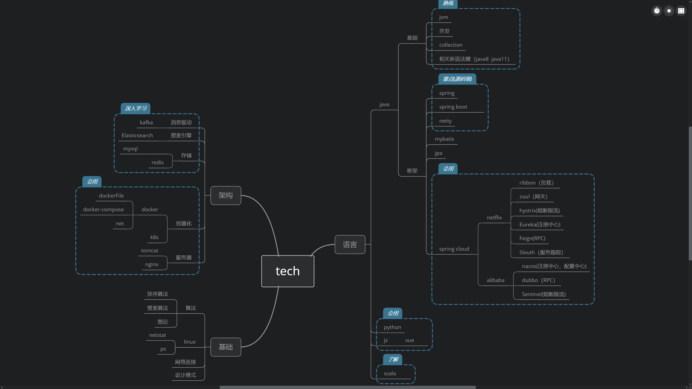

[](https://gitee.com/Eric125/boot-mybatis) [](https://gitee.com/Eric125/boot-mybatis) [](https://gitee.com/Eric125/boot-mybatis/master/LICENSE) [](https://app.codacy.com/app/Eric125/boot-mybatis?utm_source=github.com&utm_medium=referral&utm_content=Eric125/boot-mybatis&utm_campaign=Badge_Grade_Dashboard)

根据2020年知识规划图进阶


------

**2020年3月前**

> 这套面试题，后期还需要不断系统的完善起来。最后做成高级程序员面试通

[TOC]


### 面试准备

#### todo 

[待办列表](note/readme.md)

#### 基础
##### 网络

> 基于网络的面试题，主要搞清楚两个点`TCP`,`UDP`，然后就是通用的基础知识点比方说`4/7层网络模型`,`Http`相关知识点，这块可以通过 [JavaGuide](https://gitee.com/SnailClimb/JavaGuide/tree/master)来 详细学习

TCP/IP四层协议：应用层（SMTP,FTP,Telnet），传输层（TCP/UDP）,网络层（IP）,网络接口层

OSI七层：应用层，表现层，会话层，传输层，网络层，数据链路层，物理层

1. **TCP特点:** 
   1. 基于链接(点对点)
   2. 双工通道
   3. 可靠传输（三次握手四次挥手）
   4. 拥塞控制
   5. 基于字节流而非报文
2. **TCP实现细节：**
   1. 8种报文状态
   2. 滑动窗口机制
   3. KeepAlive
   4. Nagel算法
3. **UDP特点:**
   1. 非链接
   2. 非可靠传输
   3. 效率高   
   

##### 算法

1. 常用排序算法能够白班写出来 （根据执行效率从前到后）   

   冒泡排序，选择排序，插入排序，希尔排序，归并排序，快速排序

##### 设计模式

1. 白班编写常用设计模式
2. 能够熟悉`工厂模式`,`抽象工厂模式`,`命令模式`,`适配器模式`,`过滤器模式`

#### java

java基础

1. **语法**

2. **动态**

   反射讲一讲，主要概念都在哪需要反射机制，反射的性能，如何优化？

##### **jvm相关面试题**

> 对于jvm更多是考察的我们的知识面，以及面试高级工程师的时候会用到的知识点，虽然比较鸡肋，但是对于理解java执行过程，以及性能调优的时候提供了一种可行的执行方案

1. **类加载机制**
   
   > 类加载机制的基础是双亲委派模式，进阶版就是理解tomcat违背了双清委派模式，它是如何实现的，实现细节是什么样子的，为什么这样实现，有什么好处等等相关面试题

   - 描述一下JVM加载Class文件的原理(类加载过程)？
   
     [类加载流程](note/topic/java/jvm/1-7jvm流程.md#类加载过程)
   
   - 什么是类加载机制？
     `双清委派模式` 结合java类加载器一起讲解
   
   - JAVA 类加载器？
   
     [类加载器](note/topic/java/jvm/1-7jvm流程.md#类加载器)
   
   - 什么是tomcat类加载机制？
   
     [tomcat类加载器](note/topic/java/jvm/1-7jvm流程.md#类加载器)
   
2. **GC**

   > `GC`相关面试题从如何判定对象已经死亡，使用的GC算法，以及垃圾收集器，最好的，我们能够将`设置GC参数`相关的点都能够拓展的答出来

   - 怎么判断对象是否可 GC？Java 对象有哪些引用类型？有什么区别？

     判断对象是否可以GC,目前有两种方式，一种是`引用计数法`，一种是`可达性分析`，java中使用的是后者，前者对于循环引用的对象没有办法回收，

     java对象引用类型有这么几种： **强引用**，**软引用**，**虚引用**，**弱引用**，他们之前的区别主要是垃圾回收机制对于他们回收的优先顺序，强引用的都不会被回收，以此类推

   - 说下你知道的垃圾收集器

   - OOM 出现的有哪些场景？为什么会发生？

   - 怎么判断对象是否可 GC？Java 对象有哪些引用类型？有什么区别？

   - 说下你知道的垃圾回收算法

   - Minor GC 和 Full GC 有什么区别？分析过 GC 日志吗？

   - CMS 和 G1 的区别知道吗？使用场景分别是？你项目中用的是哪个？

   - 什么是分布式垃圾回收机制

   

3. **内存模型**

   > 这个点，需要和`内存区域`区别开来，同时可以和juc相关的点联系在一起回答，特别是`volatile`关键字，以及`final`关键字在java内存模型中的优化，以及线程调度与状态转换的过程。

  - 什么是java内存模型？

    [内存模型](note/topic/java/jvm/14.java内存模型.md)

4. **内存区域**

   > 这个比较简单，我们只需要回答上`方法区`,`堆`,`栈`,`本地方法栈`这几种内存区域中分别存放那种类型的数据即可

   - Java 内存结构（注：不是 Java 内存模型，别搞混）
     [内存分配](note/topic/java/jvm/8.内存分配.md)

5. **性能分析工具**

   > 了解常用的JVM参数，和性能分析工具的使用，`MAT`,`JMC`,`Jstack`等

6. **线上问题分析**

   - 假如线上服务发生 OOM，有哪些措施可以找到问题？

   - 假如线上服务 CPU 很高该怎么做？有哪些措施可以找到问题？

   - 假如线上应用频繁发生 Full GC，有哪些措施可以找到问题？

   - 一般线上环境遇到 JVM 问题，你会使用哪些工具来分析？

   - 找到问题后又该如何去解决呢？

   

 ##### 并发相关面试题(topic里面的内容还不够系统)

> 并发考察是对实际并发场景的应用，可以和线程`Thread`以及`Thread`行为组织起来，比方说线程的六种状态(New,Runnable,Blocked,Waiting,Timed_Waiting,Terminated)以及其相互转化的过程，线程之间的通信(wait,notify notifyAll)
>
> 关于这块的知识点后期可以啃啃《java并发编程之美》，《java并发编程的艺术》，《java高并发编程详解》。《Java并发编程实战（中文版）》这本书比较老，可以放下了

1. **锁类型，以及锁优化策略**

2. **cas锁**
   
   - 讲下 Volatile 吧？他是怎样做到同步的？
   
   - Volatile 为什么不支持原子性？举个例子
   
     这里可以做类比，mysql的事务支持原子性，mysql是怎么实现的呢？是通过加锁，行锁、表锁这种方式来实现事务的。
   
     那么问题来了，我们的volatile的实现是通过什么方式来实现的呢？这个时候结合[java内存模型](note/topic/java/jvm/14.java内存模型.md)来说，也就是说volatile是通过将缓存失效这种方式来实现**一致性**和通过**happen-before**来实现顺序性的，它并不是加锁的方式来实现的，所以它不支持原子性

   - Atomic 怎么设计的？有用过里面的类吗？
   
     [atomic & CAS](note/topic/java/juc/2.atomic&cas.md)
   
   
   
3. **同步锁**

   - 讲下 Synchronized？

   

4. **aqs锁机制(包括其实现类)**

   - 讲下 ReentrantLock 可重入锁？ 什么是可重入锁？为什么要设计可重入锁？

   - Synchronized 和 ReentrantLock 有什么区别？这两个有没有深入了解源码？

   - 线程安全类和线程不安全的类，项目使用的时候你会怎么选择？

   - 怎么判断项目代码哪里会有线程不安全问题？

   - JUC 里面你还知道什么其他的类吗？比如 CountDownLatch、Condition

5. **线程池(ThreadLocal,Fork/join)**

   - 线程池的种类，哪四种workqueue分别是什么？

     [线程池](note/topic/java/juc/ThreadPool.md)

   - 从源码详细说下 Java 里面的线程池吧，使用线程池有什么要注意的地方？你们公司有规范吗？

   

6. **工具类的使用**

   - Map、List、Set 分别说下你了解到它们有的线程安全类和线程不安全的类？

   - ThreadLocal 了解吗？项目有用过吗？可以说说

   

##### collection相关面试题

1. **源码**
   
   - HashMap 中怎么解决冲突的？
   
   
   
2. **各种容器类之间的对比**
   - 画下 HashMap 的结构图？HashMap 、 HashTable 和 ConcurrentHashMap 的区别？使用场景分别是？

   - ConcurrentHashMap 和 HashTable 中线程安全的区别？为啥建议用

   - ConcurrentHashMap ？能把 ConcurrentHashMap 里面的实现详细的讲下吗？

   

##### spring相关面试题

1. **ioc**
   
   - 说下 Bean 在 Spring 中的生命周期？
   
   - BeanFactory 和 ApplicationContext 有什么区别
   
   - Spring IOC 如何实现
   
   - spring context的初始化流程
   
   
   
2. **aop**

   - Spring AOP 实现原理

   

3. **mvc**
   
- 讲下你知道的 Spring 注解有哪些？该什么场景使用？
  
- Spring MVC 运行流程
  
- Spring MVC 启动流程
  
- Spring MVC的工作原理
  
- Spring中的@requestMapping的工作原理，以及@ResponseBody的工作原理
  
  这是原文： https://dzone.com/articles/using-the-spring-requestmapping-annotation
  
     这是译文： https://blog.csdn.net/sunshine_yg/article/details/80493604
  
     
  
   
  
4. **transaction**

   - Spring 事务知道吗？有了解过吗？

   - Spring 事务实现方式

   - Spring 事务底层原理

   

5. **spring boot** 

   > 通过spring boot的`启动流程`、`自动装配`、`特定注解`这三个方面回答

   - SpringBoot 自动化配置是怎么做的？有看过实现源码吗？

   - Spring Boot 中最核心的注解 SpringBootApplication 有看过源码分析过吗？

   - 你的项目中 SpringBoot 用到了哪些和其他技术栈整合的？

   - 使用 Spring 或者 SpringBoot 有遇到过什么印象深刻的问题吗？当时是怎么解决的？

   

6. **spring cloud**

   > 关于cloud 这一点，现在没有太多时间去精通了，可以通过一个小点，将spring cloud的核心思想表述出来，如果说到原理方面的问题，往自己知道的方面引入，比如`oauth2`,`hystrix`

   - 限流是如何实现的，介绍一下Hystrix？
   
     [Hystrix限流策略](note/topic/distributed/Hystrix.md)
     [Hystrix执行流程](https://segmentfault.com/a/1190000020270249)


##### mybatis相关面试题

1. **实现方式**

   - mybatis是如何实现配置动态sql的？有哪些动态SQL标签？
   
   - mybatis缓存是如何实现的？
   
   - mybatis中的主要对象有哪些？
   
   - mybatis执行流程是什么样子的？
   
   

##### dubbo相关面试题

1. **dubbo**
   
   - 如何设置dubbo的一致性hash负载均衡算法？
   - dubbo都有哪些模块，底层通信的原理都有哪些？
   - [如何自己设计一个类似 Dubbo 的 RPC 框架？](https://github.com/doocs/advanced-java/blob/master/docs/distributed-system/dubbo-rpc-design.md)
   - [分布式服务接口请求的顺序性如何保证？](https://github.com/doocs/advanced-java/blob/master/docs/distributed-system/distributed-system-request-sequence.md)
   - [分布式服务接口的幂等性如何设计（比如不能重复扣款）？](https://github.com/doocs/advanced-java/blob/master/docs/distributed-system/distributed-system-idempotency.md)
   - [如何基于 Dubbo 进行服务治理、服务降级、失败重试以及超时重试？](https://github.com/doocs/advanced-java/blob/master/docs/distributed-system/dubbo-service-management.md)
   - [Dubbo 的 spi 思想是什么？](https://github.com/doocs/advanced-java/blob/master/docs/distributed-system/dubbo-spi.md)
   - [Dubbo 负载均衡策略和集群容错策略都有哪些？动态代理策略呢？](https://github.com/doocs/advanced-java/blob/master/docs/distributed-system/dubbo-load-balancing.md)
   - [Dubbo 支持哪些序列化协议？说一下 Hessian 的数据结构？PB 知道吗？为什么 PB 的效率是最高的？](https://github.com/doocs/advanced-java/blob/master/docs/distributed-system/dubbo-serialization-protocol.md)
   - [说一下 Dubbo 的工作原理？注册中心挂了可以继续通信吗？](https://github.com/doocs/advanced-java/blob/master/docs/distributed-system/dubbo-operating-principle.md)
   

#### 组件
##### mysql 相关面试题

> mysql相关面试题，只需要把[高性能mysql第三版]()啃透，基本就没有问题了

1. **schema**

2. **锁**
    通过以下几个点分析（表锁，行级锁，共享锁，排它锁）

3. **事务**
   
   - 数据库事务特性和隔离级别

   - 事务分类（扁平化事务，带保存点的扁平事务，链事务，嵌套事务，分布式事务）
   
   
   
4. **索引**

   - 你对数据库了解多少？说下数据库的索引实现和非主键的二级索引

   - 说下 MySQL 的索引原理

   - 讲下 InnoDB 和 MyISAM 的区别？使用场景是？

   - InnoDB 数据库模型？B+树具体说说都保存了什么？叶子结点保存了什么？

   - 有和 ElasticSearch 的索引原理对比过吗？

   - 如何判断一个查询 sql 语句是否使用了索引？

   - mysql的innodb索引数据结构为什么会是b+树的，用hash来实现可以吗？

   

5. **分布式，以及分库分表**

   - 分库分表的解决方案

   - 分库分表之后的id主键处理

   - 如何设计动态扩容的分库分表方案

   - 不停机分库分表

   - 读写分离原则

   

6. **调优**
   - 项目数据库表是你设计的吗？一般要注意什么？如何考虑扩展性？
- 项目 MySQL 的数据量和并发量有多大？量大后的影响有哪些，有考虑吗？SQL 调优有哪些技巧？
   - sql 优化有哪些思路？
- 索引使用注意事项？
   - 常见的mysql主从同步方案都有哪些？优劣势都有哪些？


##### redis相关面试题

> redis在项目中使用得比较多，虽然比较简单，但其实底层有很多可圈可点的知识点需要学习，比如说`epoll单线程模型`，`持久化方式`,`过期策略`,`分布式相关设置`等,关于这一点可以参考[石杉码农笔记](https://github.com/doocs/advanced-java)，视频和文档一起食用，效果更佳

1. **redis数据结构，以及原理**
   
   - 你说知道的nosql都有哪些（mongoDb,hbase,Cassanddra,pika）
   
   - Redis支持哪几种数据类型？
   
     String,List,Set,Hash,ZSet
   
     如果更深入一点，可以将这几种数据类型的实现方式分别将出来，查看对象的实现方式用一下命令：
   
     ```
     Object ENCODING objName
     ```
   
     | 类型   | 实现方式           |
     | ------ | ------------------ |
     | String | int,raw,embstr     |
     | List   | zipList,LinkedList |
     | Set    | intset,hashtable   |
     | Hash   | zipList,hashtable  |
     | ZSet   |                    |
     
   - 一个字符串类型的值能存储最大容量是多少？
     一个键最大能够存储512MB
   
   - Redis和Redisson有什么关系？
   
   - Redis支持的Java客户端都有哪些？官方推荐用哪个？
   
   - Redis回收进程如何工作的？
   
   - Redis key的过期策略有哪些？过期时间和永久有效分别怎么设置？
   
   - redis线程模型是怎样的？
   
   - 如何手写一个LRU算法？
   
     ```java
     public class LRUCache<K, V> extends LinkedHashMap<K, V> {
         private final int CACHE_SIZE;
     
         /**
          * 传递进来最多能缓存多少数据
          *
          * @param cacheSize 缓存大小
          */
         public LRUCache(int cacheSize) {
             // true 表示让 linkedHashMap 按照访问顺序来进行排序，最近访问的放在头部，最老访问的放在尾部。
             super((int) Math.ceil(cacheSize / 0.75) + 1, 0.75f, true);
             CACHE_SIZE = cacheSize;
         }
     
         @Override
         protected boolean removeEldestEntry(Map.Entry<K, V> eldest) {
             // 当 map中的数据量大于指定的缓存个数的时候，就自动删除最老的数据。
             return size() > CACHE_SIZE;
         }
     }
     ```
     
     
   
2. **集群**

   - Cluster集群模式的原理？

   - Redis集群方案应该怎么做？都有哪些方案？（主从，sentinel这两个点回答）

   - Redis集群方案什么情况下会导致整个集群不可用？

   - Redis集群的主从复制模型是怎样的？

   - Redis集群之间是如何复制的？

   - Redis集群会有写操作丢失吗？为什么？

   - 怎么理解Redis事务？

   - Redis中的管道有什么用？

   - Redis集群如何选择数据库？

   - redis并发竞争问题该如何解决

3. **缓存**

   - redis 数据持久化方案（redis挂机后数据恢复方案）

   - redis分布式缓存该如何做

   

4. **应用调优**
   
   - MySQL里有2000w数据，redis中只存20w的数据，如何保证redis中的数据都是热点数据？
   
   - Redis有哪些适合的场景？
   
   - Redis如何做内存优化
   
   - 贵司之前的redis架构如何做的
   
   - redis缓存穿透，缓存击穿，缓存雪崩解决方案
   
   

##### elasticsearch相关面试题

> 针对搜索引擎，以及搜索引擎底层相关知识点的考察，原理性的东西，可以参考可以石杉码农笔记](https://github.com/doocs/advanced-java)，具体api使用参考[官方文档](https://www.elastic.co/guide/en/elasticsearch/reference/6.8/index.html)(官方文档写的真的详细)，[中文官方文档](https://www.elastic.co/guide/cn/elasticsearch/guide/current/foreword_id.html)只有2.x

1. **分布式原理**

   - es是如何实现分布式的

     https://github.com/doocs/advanced-java/blob/master/docs/high-concurrency/es-architecture.md

   - 分布式搜索引擎的架构是怎么设计的？

   - 分布式搜索引擎在几十亿数据量级如何优化？

   - elasticsearch是如何实现master选举的？

   - 在并发情况下，Elasticsearch如果保证读写一致？

   - 如何解决ES集群的脑裂问题？

2. **数据存储**

   - es写入数据的工作原理是什么，es查询数据的工作原理是什么？

   - 写入和查询的工作流程是什么样的？

   - lucence内部结构是什么，什么是倒排索引？

   - 详细描述一下Elasticsearch索引文档的过程？

3. **高速查询**

   - 详细描述一下Elasticsearch搜索的过程？更新和删除的过程呢？

4. **实战问题**

   - es在数据量很大的情况下，如何提高查询的性能？

   - elasticsearch 索引数据多了怎么办，如何调优，部署？

   - elasticsearch在部署时，对Linux的设置有哪些优化方法？

   - elasticsearch了解多少，说说你们公司es的集群架构，以及一些调优手段？

   - 对于GC方面，在使用Elasticsearch时要注意什么？

   - Elasticsearch对于大数据量（上亿量级）的聚合如何实现？

   

##### kafka相关面试题

​	 kafka相关面试题[kafka专题](./note/topic/kafka/0.题目总览.md)

##### netty相关面试题

> 针对netty相关的面试题，其实是涉及到的网络编程，RPC相关的知识点，可以将redisjava客户端中使用到netty,elasticsearch java客户端使用了netty,dubbo中使用了netty等来说明netty中的重要性

1. **特性**
   
   - netty 一般使用场景
   
   - 什么是TCP 粘包/拆包？
   
     **tcp 接收到包的几种表现形式**
   
     1. 接收端正常收到两个数据包
   
        
   
     2. 接收端只收到一个数据包
   
        
   
     3. 接收端收到了两个数据包，但是这两个数据包要么是不完整的，要么就是多出来一块
   
        
   
        
   
     **发生原因：**
   
     1. 要发送的数据大于TCP发送缓冲区剩余空间大小，将会发生拆包。
     2. 待发送数据大于MSS（最大报文长度），TCP在传输前将进行拆包。
     3. 要发送的数据小于TCP发送缓冲区的大小，TCP将多次写入缓冲区的数据一次发送出去，将会发生粘包。
     4. 接收数据端的应用层没有及时读取接收缓冲区中的数据，将发生粘包。
   
     **解决办法**
   
     1. 发送端给每个数据包添加包首部，首部中应该至少包含数据包的长度，这样接收端在接收到数据后，通过读取包首部的长度字段，便知道每一个数据包的实际长度了。
     2. 发送端将每个数据包封装为固定长度（不够的可以通过补0填充），这样接收端每次从接收缓冲区中读取固定长度的数据就自然而然的把每个数据包拆分开来。
     3. 可以在数据包之间设置边界，如添加特殊符号，这样，接收端通过这个边界就可以将不同的数据包拆分开。
   
     **netty中的战报和拆包解决方案**
   
     1. FixedLengthFrameDecoder(固定长度的拆包器 )
   
     2. LineBasedFrameDecoder(行拆包器 )
   
     3. DelimiterBasedFrameDecoder(分隔符拆包器)
   
     4. LengthFieldBasedFrameDecoder(基于数据包长度的拆包器)
   
        
   
   - netty的内存池是怎么实现的?
   
     可以参考着两篇文章看看
   
     https://www.jianshu.com/p/8d894e42b6e6
   
     https://blog.csdn.net/pentiumchen/article/details/45372625
   
     
   
   - netty的对象池是怎么实现的?
   
     https://www.cnblogs.com/wxd0108/p/6681623.html?utm_source=itdadao&utm_medium=referral
   
     https://www.jianshu.com/p/3bfe0de2b022
   
     
   
   - NIO 组成部分？
   
     ByteBuffer,Selector,Channel
   
     
   
   - netty的高性能体现在什么地方？（心跳，串行无锁化设计，可靠性，安全性，流量整型）
     
   https://www.cnblogs.com/wuzhenzhao/p/11202952.html
     
   https://www.cnblogs.com/itxiaok/p/10358052.html
     
     
     
   - webSocket帧结构的理解，如何实现WebSocket长连接
     
   https://www.zhihu.com/question/20215561
     
     
     
   - 主要概念包括哪些方面？他们之间的关系是什么样点的
   
   ​		
   
2. **模型**

   - Netty 线程模型

     在**Reactor**的基础上做了升级，如图

     

   - 说说 Netty 的零拷贝？
    https://my.oschina.net/plucury/blog/192577
     
   - Netty 内部执行流程？
     
     见 Netty 线程模型图
     
     
     
   - Netty如何 重连实现？
     
     https://segmentfault.com/a/1190000006931568
     
   - 开源RPC框架了解哪些?
     
     dubbo,Thrift,gRPC,Spring cloud,等吧
     
     
   
   - RPC与HTTP的区别是什么？什么场景选用RPC,什么场景适合HTTP？
     todo 搞清楚RPC HTTP RESTFul几者之间的关系吧
   
     
   
   - RPC的交互流程是什么样子的？
   
     https://www.cnblogs.com/SamllBaby/p/5695478.html

##### git相关面试题

1. 后期归类

   https://segmentfault.com/a/1190000019315509

   https://www.edureka.co/blog/interview-questions/git-interview-questions/


#### 项目相关

1. 项目实战相关问题

   - zookeeper实现分布式所的原理，以及redis具体怎么实现分布式锁？

   - 如果让你实现一个MQ,怎么保证消息不丢失？

   - 分布式事务的实现？

     https://www.zhihu.com/question/64921387

     https://www.jianshu.com/p/ee4071d0c951

   - 如何解决redis和mysql中数据一致性问题？

   - 先谈谈秒杀的设计思路？

   - 谈谈秒杀如何防止超卖？


可以想把和几个git上的项目pull 下来，学习

https://github.com/frank-lam/fullstack-tutorial/blob/master/notes/MySQL.md

https://github.com/hadyang/interview

https://github.com/doocs/advanced-java

------

2020年3月之后

深入学习spring 源码